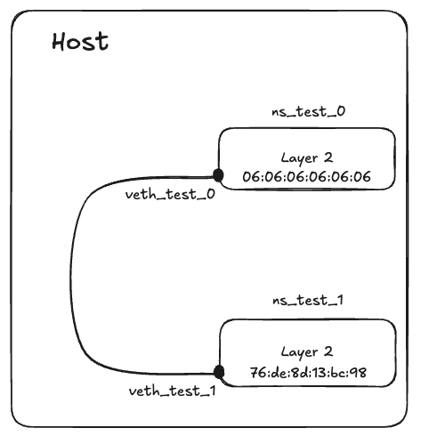
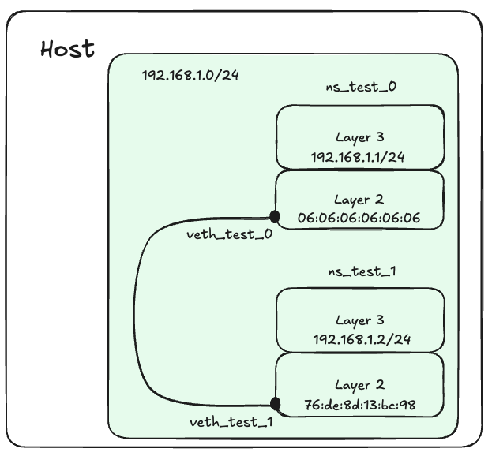
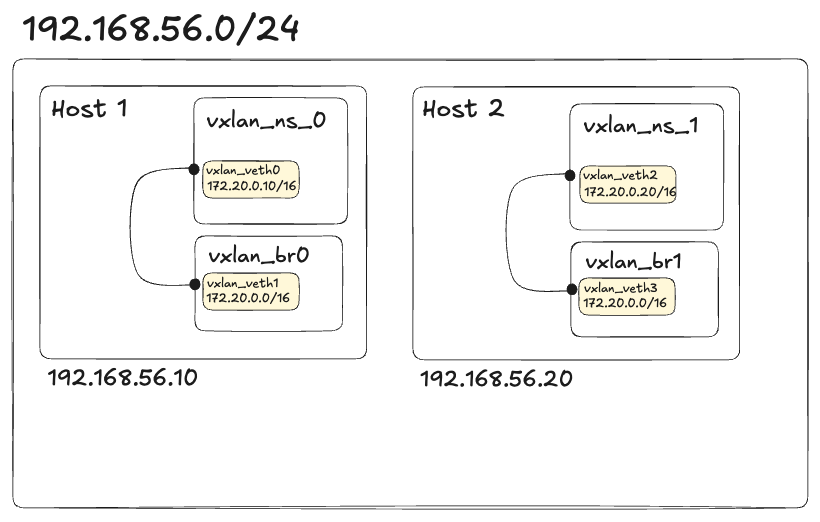
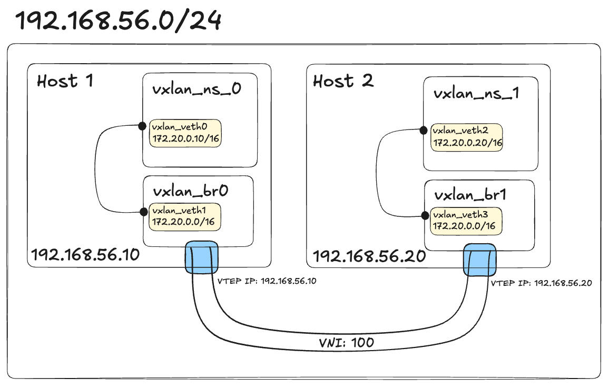

+++
title = 'VXLAN implementation with Linux Network Namespace'
date = 2025-05-18T03:45:24+09:00
draft = false
+++

> 해당 글은 [Linux Namespaces](https://plaintexting.com/knowledge_base-reviews/linux-namespaces/) 에 대한 연장선상에 있는 Linux Network Namespace에 대한 개념을 기반으로 하여, 다중 호스트 간 통신 구현까지 넓은 범위의 내용을 다룹니다. 따라서 명시적인 글의 분류와 실 내용에 차이가 있을 수 있습니다.

# Network Namespace

리눅스 커널의 네임스페이스 기능 중 하나로, 프로세스의 **네트워크 환경을 분리**하는 네임스페이스이다. 네트워크 환경을 분리하면 각기 다른 네임스페이스에 속한 프로세스들에게 고유한 네트워크 인터페이스를 부여하고, IP 인터페이스를 지정하여 새로운 IP를 부여하는 작업을 진행할 수 있다. 또한 네트워크 상 격리된 환경을 조성하기 때문에, 많은 부분에서의 보안 취약점을 커버하거나 원치 않는 트래픽 부하로 인한 컴퓨팅 자원 낭비 등 다양한 이점을 가져올 수 있다.

네트워크 네임스페이스는 다음과 같은 구셩 요소들에 대한 격리를 수행한다.

- 라우팅 테이블
- 방화벽 규칙
- IP 인터페이스(IP주소)
- 기타 네트워크 관련 설정

라우팅 테이블은 해당 네임스페이스가 IP 인터페이스를 할당받고 올바른 트래픽을 외부에서 받아들이기 전까지는 기본적으로 내부에서의 트래픽 제어를 담당하게 된다. 격리된 네트워크망이 구성되어 있는 상태에서 내부 자원들 간의 통신을 담당하게 된다. 이때 기본적으로 IPv4를 기반으로하는 3계층 트래픽 제어를 수행한다.

내부에서 사용되는 IP인터페이스들에 할당된 주소들을 외부와 단절시켜 내부에서만 제어될 수 있도록 한다. 즉, 기본적으로 격리된 환경에서는 인터넷과 같은 외부 환경과의 통신이 불가하다는 것이다.
이는 다음과 같은 간단한 테스트를 통해 알 수 있다.

아래에서 사용된 ip 라는 도구는 netlink를 기반으로 하는 iproute2 도구 모음의 구성 요소 중 하나이며, 현대 linux 네트워크 제어의 대부분의 역할을 쉽게 수행하도록 돕는다. 이번 글에서도 매우 요긴하게 사용되니, 기본적인 사항들에 대해 알아두면 좋다.

또한 netlink를 기반으로 하기 때문에 비동기 IO가 가능하고, 프로세스 멀티캐스팅을 지원해 기존 도구에 비해 관찰가능성이 매우 향상되었다…등의 추가 내용들이 존재하지만, 여기서 깊게 다루지 않는다.

```bash
// netns 서브 명령어를 통해 네트워크 네임스페이스 작업을 수행한다.
sudo ip netns add testns
sudo ip netns exec testns ping 1.1.1.1
ping: connect: Network is unreachable
```

ping이 ICMP solicitation을 수행하는데, 격리된 네트워크에 있으니 `Network is unreachable` 이라는 에러를 반환하게 된다(ICMP Type=3, Code=0).

이처럼 네트워크 네임스페이스는 우리가 흔히 ‘네트워크’라고 부르는 격리 단위를 호스트 내에 하나 생성하는 역할을 한다.

이는 단순히 네트워크 트래픽을 분리하고 제어하는 것을 넘어 컨테이너 가상화 및 VPN, NAT 등 다양한 형태의 현대적인 네트워크 설계를 구현하는 기반으로 작용해오고 있다. 이번 글에서는 이러한 네트워크 네임스페이스를 적극 활용하여 단일 및 다중 호스트 간의 다양한 환경에 대한 트래픽 제어 테스트를 진행하고자 한다.

# 단일 호스트 내 네트워크 네임스페이스 간 통신

## 2계층 구성

단일 호스트 내 네트워크 네임스페이스 간 통신을 수행하려면 veth라고 하는 일종의 다리를 만들어 놓아주어야 한다. veth는 이름에서 유추할 수 있는 것처럼 virtual ethernet이며, 실제 2계층 이더넷 케이블의 역할을 소프트웨어로 구현하여 가상화한 요소이다.

그렇기 때문에 veth에서는 실제로 ARP와 같은 2계층 프로토콜을 기반으로하는 패킷 처리 과정이 진행되며, veth가 실제 2계층을 가상화하고 있음을 확인할 수 있다.

먼저 통신을 진행할 네트워크 네임스페이스 두 개를 만들어준다.

```bash
sudo ip netns add ns_test_0
sudo ip netns add ns_test_1
```

veth를 만드는 것은 `ip` 도구를 통해 어렵지 않게 수행 가능하다.

```bash
sudo ip link add veth_test_0 veth peer name veth_test_1
```

veth는 ‘연결’을 목적으로 하는 가상 기기이므로 항상 만들어질 때 쌍으로 만들어지며, 각 쌍을 통신을 진행할 네트워크 네임스페이스에게 붙여주는 과정이 필요하다.

```bash
sudo ip link set veth_test_0 netns ns_test_0
sudo ip link set veth_test_1 netns ns_test_1
```

이제 ns_test_0과 ns_test_1은 각각 veth_test_0과 veth_test_1을 앞 단에 가지며 둘은 서로 간에 패킷을 주고받을 수 있는 상태가 된다.

네임스페이스가 가지는 네트워크 인터페이스 목록을 출력하면 다음과 같다.

```bash
sudo ip netns exec ns_test_0 ip -br link
lo               DOWN           00:00:00:00:00:00 <LOOPBACK>
veth_test_0@if6  DOWN           e6:ec:d5:d7:be:c1 <BROADCAST,MULTICAST>
```

여기서 궁금한 점이 하나 생긴다.

veth에 MAC주소는 우리가 직접 부여하지 않았는데, 어떤 메커니즘을 기반으로 부여되는걸까? 실제로 이는 무작위로 생성되며, 실제로 우리가 원하는 MAC 주소가 있다면 이를 부여할 수도 있다.

다만 예약된 00:00:00:00:00:00 이나 ff:ff:ff:ff:ff:ff, 혹은 멀티캐스트를 위한 **01:00:0E** 로 시작하는 주소 (실제로 멀티캐스트 MAC 주소 부여 방지를 위해서 첫 옥텟의 LSB가 1로 설정되는 경우는 전부 막고 있다)는 제외하자.

이외에도 실제 MAC주소들은 해당 물리 장치를 만든 제조사의 고유 번호가 추가로 담기기 때문에, 뭐…굳이 필요한 것이 아니라면 무작위로 생성되는 것을 부여받는게 좋지 않을까 싶다(사실 가상환경이라 제조사 뭐시기도 신경쓰지 않아도 됨).

아래와 같이 명령어를 통해 자체적으로 MAC주소 부여가 가능하다.

```bash
sudo ip netns exec ns_test_0 ip link set veth_test_0 address 06:06:06:06:06:06
```

이후 확인해보면,

```bash
sudo ip netns exec ns_test_0 ip -br link
lo               DOWN           00:00:00:00:00:00 <LOOPBACK>
veth_test_0@if6  DOWN           06:06:06:06:06:06 <BROADCAST,MULTICAST>
```

변경된 MAC주소를 확인할 수 있다.

이렇게 두 네임스페이스 간에 2계층으로 연결되었다. 이제 두 네임스페이스 간에 ip 주소를 부여하여 서로를 3계층 장치 기반으로 인식 가능하돌고 하자. 그렇게 하면 ping을 이용해 통신을 테스트할 수 있다.

여기서 다시 잠깐. 3계층을 쌓아올리기 전에 2계층 만으로 테스트를 할 수는 없는걸까?
사실 일반적인 경우 2계층만 있는 곳에서 테스트를,,거의 하지 않기 때문에 기본적인 도구는 알려진 바가 많지 않다.

우리는 여기서 `etherwake` 라는 도구를 사용해서 이더넷 프레임을 임의로 생성하고 전송해보고자 한다(3계층을 쌓지 않은 상태에서 2계층만 작용하므로 ‘프레임’ 이라는 단어를 사용했다). 다른 도구(arping 등)의 경우 방법이 조금 복잡하거나 IP부여가 진행된 후에만 가능한 방법들이었다.

`etherwake` 를 설치하고, 브로드캐스트 이더넷 프레임과 유니캐스트 이더넷 프레임을 전송 및 탐지해보자.

감지는 `tcpdump` 를 이용해서 진행할건데, 어차피 ip 주소 부여가 되어있지 않아서 2계층 감지 말고는 할 수 있는 일이 없다.

먼저 수신자 네임스페이스 측에서 모니터링을 수행하자.

```bash
sudo ip netns exec ns_test_0 tcpdump -i veth_test_0
tcpdump: verbose output suppressed, use -v[v]... for full protocol decode
listening on veth_test_0, link-type EN10MB (Ethernet), snapshot length 262144 bytes
```

이후 송신자 네임스페이스 측에서 etherwake를 이용해서 유니캐스트 프레임을 전송하자.

```bash
sudo apt-get install etherwake

// 위에서 직접 설정해준 MAC주소를 사용해서 보내보자.
sudo ip netns exec ns_test_1 etherwake -i veth_test_1 06:06:06:06:06:06
```

이후 수신자 네임스페이스 측의 결과를 보면 다음과 같이 나온다.

```bash
sudo ip netns exec ns_test_0 tcpdump -i veth_test_0
tcpdump: verbose output suppressed, use -v[v]... for full protocol decode
listening on veth_test_0, link-type EN10MB (Ethernet), snapshot length 262144 bytes
^C13:29:08.604670 76:de:8d:13:bc:98 (oui Unknown) > 06:06:06:06:06:06 (oui Unknown), ethertype Unknown (0x0842), length 116:
	0x0000:  ffff ffff ffff 0606 0606 0606 0606 0606  ................
	0x0010:  0606 0606 0606 0606 0606 0606 0606 0606  ................
	0x0020:  0606 0606 0606 0606 0606 0606 0606 0606  ................
	0x0030:  0606 0606 0606 0606 0606 0606 0606 0606  ................
	0x0040:  0606 0606 0606 0606 0606 0606 0606 0606  ................
	0x0050:  0606 0606 0606 0606 0606 0606 0606 0606  ................
	0x0060:  0606 0606 0606                           ......

1 packet captured
1 packet received by filter
0 packets dropped by kernel
```

이외에 송신자 측에서 브로드캐스트 프레임도 전송해보자.

```bash
sudo ip netns exec ns_test_1 etherwake -i veth_test_1 ff:ff:ff:ff:ff:ff
sudo ip netns exec ns_test_1 etherwake -i veth_test_1 ff:ff:ff:ff:ff:ff
```

다시 수신자 측의 결과를 살펴보자.

```bash
sudo ip netns exec ns_test_0 tcpdump -i veth_test_0 -e ether broadcast
tcpdump: verbose output suppressed, use -v[v]... for full protocol decode
listening on veth_test_0, link-type EN10MB (Ethernet), snapshot length 262144 bytes
^C13:24:22.015756 76:de:8d:13:bc:98 (oui Unknown) > Broadcast, ethertype Unknown (0x0842), length 116:
	0x0000:  ffff ffff ffff ffff ffff ffff ffff ffff  ................
	0x0010:  ffff ffff ffff ffff ffff ffff ffff ffff  ................
	0x0020:  ffff ffff ffff ffff ffff ffff ffff ffff  ................
	0x0030:  ffff ffff ffff ffff ffff ffff ffff ffff  ................
	0x0040:  ffff ffff ffff ffff ffff ffff ffff ffff  ................
	0x0050:  ffff ffff ffff ffff ffff ffff ffff ffff  ................
	0x0060:  ffff ffff ffff                           ......
13:25:33.643005 76:de:8d:13:bc:98 (oui Unknown) > Broadcast, ethertype Unknown (0x0842), length 116:
	0x0000:  ffff ffff ffff ffff ffff ffff ffff ffff  ................
	0x0010:  ffff ffff ffff ffff ffff ffff ffff ffff  ................
	0x0020:  ffff ffff ffff ffff ffff ffff ffff ffff  ................
	0x0030:  ffff ffff ffff ffff ffff ffff ffff ffff  ................
	0x0040:  ffff ffff ffff ffff ffff ffff ffff ffff  ................
	0x0050:  ffff ffff ffff ffff ffff ffff ffff ffff  ................
	0x0060:  ffff ffff ffff                           ......

2 packets captured
2 packets received by filter
0 packets dropped by kernel
```

프레임들이 정상적으로 송신 및 수신됨을 확인할 수 있다.
IP가 없이 2계층 통신만 진행하다보니 서브넷이나 라우팅 테이블과 같은 추가적인 사항에 대한 제약 없이 간단명료하게 트래픽을 예측하고 확인할 수 있다.

이제 2계층 구성이 끝났다.
간단하게 지금까지의 구성을 그려보면 아래와 같다.



_그림에서 주의해야하는 것이. 네트워크 네임스페이스라고 함은 네트워크를 격리한 논리 공간으로 여겨지는 것이 맞으나 현재는 IP를 할당함으로써 마치 하나의 호스트처럼 동작하는 것을 확인하고 있기 때문에 위와 같이 네임스페이스를 하나의 호스트처럼 묘사하였다._

## 3계층 구성

> 이번 글의 목표는 네트워크 네임스페이스의 역할을 알아보는 것이고, 그 중 중요하게 다가오는 IP주소 격리를 기반으로 하는 ‘프로세스의 호스트화’를 확인하는 과정이다.
>
> 이후 상위 계층에 대해서는 네트워크 네임스페이스 위의 내용이기 때문에, 해당 글에서는 진행하지 않는다.

앞서 가상화된 환경에 2계층을 쌓아 올렸고, IP 없이도 두 네임스페이스 간의 통신이 잘 이루어지고 있음을 확인했다.

이제 각 네트워크 네임스페이스 앞단의 인터페이스들에 IP주소를 부여하고, IP주소를 기반으로 하는 패킷 통신을 진행하자.

```bash
sudo ip netns exec ns_test_0 ip addr add 192.168.1.1/24 dev veth_test_0
sudo ip netns exec ns_test_1 ip addr add 192.168.1.2/24 dev veth_test_1
```

두 인터페이스를 동일한 서브넷에 포함시켰기 때문에(192.186.1.X), 별도의 게이트웨이 설정 없이도 둘의 통신이 원활하게 이루어진다.

```bash
sudo ip netns exec ns_test_0 ping 192.168.1.2
PING 192.168.1.2 (192.168.1.2) 56(84) bytes of data.
64 bytes from 192.168.1.2: icmp_seq=1 ttl=64 time=0.021 ms
64 bytes from 192.168.1.2: icmp_seq=2 ttl=64 time=0.022 ms
^C
--- 192.168.1.2 ping statistics ---
2 packets transmitted, 2 received, 0% packet loss, time 1036ms
rtt min/avg/max/mdev = 0.021/0.021/0.022/0.000 ms
```

그럼 여기서 만약 둘을 다른 서브넷에 배치하면 어떻게 되나?

이런 경우 두 네임스페이스의 라우팅 테이블 설정이 추가적으로 필요한데, 현재의 라우팅 테이블을 확인해보자.

```bash
sudo ip netns exec ns_test_0 route
Kernel IP routing table
Destination     Gateway         Genmask         Flags Metric Ref    Use Iface
192.168.1.0     0.0.0.0         255.255.255.0   U     0      0        0 veth_test_0
```

위와 같이 본인이 속한 서브넷에 대해서만 명시되어있다.

현재 별도로 설정된 default router는 없으므로 0.0.0.0 gateway로 향하는 트래픽이라면 그냥 죽겠지만, 마지막에 IFace가 veth_test_0으로 설정되어 있으므로 무리없이 해당 인터페이스와 연결된 veth_test_1 로 이동할 수 있게 되어있다.

이 과정에서 두 네임스페이스가 동일 서브넷에 속해 있으므로(192.168.1.0/24), 트래픽이 중간에 네트워크를 찾지 못하는 문제가 발생하지 않는다.

위 상황을 간단히 그려보면 아래와 같다.



이제 여러 상황을 추가해보자.

이제 ns_test_1을 다른 서브넷에 속하도록 만들 것이다.

```bash
sudo ip netns exec ns_test_1 ip addr add 192.168.2.1/24 dev veth_test_1
```

위와 같이 명령어를 입력하여 veth_test_1 위에 IP 인터페이스를 추가할 수 있다.
이 경우 route를 수행해 인터페이스 목록을 살펴보면 아래와 같이 나타난다.

```bash
sudo ip netns exec ns_test_1 ip addr show veth_test_1
6: veth_test_1@if7: <BROADCAST,MULTICAST,UP,LOWER_UP> mtu 1500 qdisc noqueue state UP group default qlen 1000
    link/ether 76:de:8d:13:bc:98 brd ff:ff:ff:ff:ff:ff link-netns ns_test_0
    inet 192.168.2.1/24 scope global veth_test_1
       valid_lft forever preferred_lft forever
    inet 192.168.1.2/24 scope global veth_test_1
       valid_lft forever preferred_lft forever
    inet6 fe80::74de:8dff:fe13:bc98/64 scope link
       valid_lft forever preferred_lft forever
```

오잉? 기존에 존재하던 192.168.1.2/24 IP 인터페이스가 공존한다. 이는 하나의 IP 인터페이스에도 여러 주소가 할당될 수 있기 때문에 자연스러운 현상이며, 이런 경우 ns_test_1 네임스페이스는 192.168.1.0/24와 192.168.2.0/24 모두에 속하게 된다.

그럼 다음을 수행해보자. 이런 상황은 무엇이 문제인 걸까?

```bash
sudo ip netns exec ns_test_0 ping 192.168.2.1
ping: connect: Network is unreachable
```

이 경우 어렵지 않게 문제를 확인할 수 있는데, 앞선 과정에서 확인했던 ns_test_0의 라우팅 테이블 현황과Network is unreachable (ICMP Type=3, Code=0) 에러가 발생한 것을 보아 ns_test_0 자체 라우팅 테이블에서부터 막혀서 패킷이 단 한 hop도 이동하지 못했다는 것을 알 수 있다.

즉, 길은 veth_test_0을 통해서 깔려 있지만 문이 열리지 않았다는 것으로 비유해볼 수 있다.
그러면 192.168.2.0/24 네트워크에 속하는 패킷이 잘 이동할 수 있도록 관련 라우팅 규칙을 추가해주자.

```bash
sudo ip netns exec ns_test_0 ip route add 192.168.2.0/24 dev veth_test_0
```

이제 라우팅 테이블을 다시 확인해보면,

```bash
sudo ip netns exec ns_test_1 route
Kernel IP routing table
Destination     Gateway         Genmask         Flags Metric Ref    Use Iface
192.168.1.0     0.0.0.0         255.255.255.0   U     0      0        0 veth_test_1
192.168.2.0     0.0.0.0         255.255.255.0   U     0      0        0 veth_test_1
```

좋다. 이제 veth_test_0 으로 ns_test_0의 인터페이스들에는 없는 네트워크 대역으로 트래픽을 보낼 수 있도록 되어 있다. 다행인 점은 반대쪽 veth_test_1이 UP 상태이기 때문에 veth_test_1을 통한 트래픽에 열려있다는 것이다. 따라서 ping 수행 시 이러한 결과를 얻을 수 있다.

```bash
sudo ip netns exec ns_test_0 ping 192.168.2.1
PING 192.168.2.1 (192.168.2.1) 56(84) bytes of data.
64 bytes from 192.168.2.1: icmp_seq=1 ttl=64 time=0.020 ms
64 bytes from 192.168.2.1: icmp_seq=2 ttl=64 time=0.018 ms
^C
--- 192.168.2.1 ping statistics ---
2 packets transmitted, 2 received, 0% packet loss, time 1036ms
rtt min/avg/max/mdev = 0.018/0.019/0.020/0.001 ms
```

그리고 여기서 중요한 점은 앞선 ns_test_1에서의 IP 인터페이스 목록이다. veth_test_1이라는 인터페이스에 여러 개의 IP를 설정해두었고, 덕분에 veth_test_0 <=> veth_test_1이라는 가상 이더넷을 통해서는 192.168.1.0/24와 192.168.2.0/24 패킷이 모두 오갈 수 있다는 것을 유추할 수 있었다.

하지만 아직 ns_test_0 에 대해서는 라우팅 테이블을 업데이트해두지 않았다. 따라서 직접 ns_test_0에서 192.168.2.0/24로 트래픽을 보내고자 시도하게 된다면 아마 Network를 찾을 수 없다는 에러를 확인하게 될 것이다.

이처럼 라우팅 테이블과 IP 인터페이스 제어를 통해 우리는 3계층 단위에서 IP기반으로 트래픽을 선택적으로 제어할 수 있게 되었다. 이는 IP주소를 부여할 수 있도록 하는 네트워크 네임스페이스의 기능 덕분이며, 이를 통해 각 네트워크를 마치 호스트처럼 다룰 수 있게 되었다.

이러한 예시는 일반적인 클라우드 서비스들의 VPC 및 서브넷에 대한 Inbound, Outbount 트래픽 제어 (혹은 현대적인 의미에서의 Ingress, Egress에 대치할 수도 있겠다)의 가장 단순한 형태를 보여주며, 각 방향의 트래픽을 어떻게 독립적으로 관리하는지에 대해 살펴볼 수 있었다.

# 다중 호스트 간 VXLAN 통신

지금까지는 단일 호스트 내에서 여러 네트워크 네임스페이스들 만들고, 이들 간의 트래픽을 제어해봄으로써 기본적인 가상화된 네트워크 환경에서의 통신 방법을 알아보았다.

지금부터는 조금 더 실제에 가까운 구현을 위해 여러 호스트를 두고, 각 호스트 간에 트래픽이 어떻게 오가는지 확인한다. 이후 더 나아가 이러한 다중 호스트 내에서의 네트워크 네임스페이스들을 마치 하나의 3계층 위에서 동작하는 것처럼 하는 오버레이 기술에 대해 살펴보며, VXLAN을 활용해서 오버레이 네트워크를 직접 구현한다. 이후 이를 확장하여 다중 네트워크 네임스페이스 대신 다중 컨테이너 환경을 구축하는 예시도 살펴본다.

## 기본적인 설명

VXLAN은 이름 자체는 VLAN의 확장판…처럼 보이지만 실상 기능은 그것보다 더욱 넓고 독자적인 범위의 것을 포함한다. 기존에 물리적인 네트워크를 논리적으로 분리하던 기술인 VLAN에서 더 나아가, L2/L3 네트워크를 확장하고 내부 호스트 및 가상화된 환경 내에서의 자유로운 이동성을 제공하는 독자적인 기술이다.

기본적으로는 새로 도입되는 VNI, VTEP등의 개념 요소들을 기반으로하여 추가적으로 패킷을 캡슐화하게 되는데, 이를 통해 기존 3계층 위에 완전히 새롭게 2계층 네트워크를 구축하도록 돕는다. 이를 통해 물리적으로 떨어진 호스트 내 가상화된 환경들 간에도 자유로운 연결이 가능해지도록 하는 이점을 가진다.

단순히 문단으로 표현하기에는 많은 확장성을 가지는 기술이기 때문에, 해당 글에서는 구현에 초점을 맞추고자 한다. 직접 다양한 자료를 찾아보고 공부하면 더욱 이해해 도움이 될 것이다.

## 구현

> 네트워크 환경
>
> Host-Only Network: 192.168.56.1/24~192.168.56.99/24 를 허용하도록 해주어 두 호스트 간의 기본 통신이 가능하도록 설정하였고, Host-Only Network의 인터페이스에 대해서는 DHCP를 끄고 `/etc/netplan` 내에 192.168.0.10과 192.168.0.20을 수동으로 추가해주었다.

네트워크 환경에 대한 이해를 돕고자 Host 1의 기본 IP 인터페이스 목록 정보를 추가한다. enp0s8은 NAT로 ssh연결을 하고자 설정되어있고, enp0s9이 VXLAN 구축에 사용되는 Host-Only Network 인터페이스이다.

```bash
1: lo: <LOOPBACK,UP,LOWER_UP> mtu 65536 qdisc noqueue state UNKNOWN group default qlen 1000
    link/loopback 00:00:00:00:00:00 brd 00:00:00:00:00:00
    inet 127.0.0.1/8 scope host lo
       valid_lft forever preferred_lft forever
    inet6 ::1/128 scope host noprefixroute
       valid_lft forever preferred_lft forever
2: enp0s8: <BROADCAST,MULTICAST,UP,LOWER_UP> mtu 1500 qdisc fq_codel state UP group default qlen 1000
    link/ether 08:00:27:06:c5:7f brd ff:ff:ff:ff:ff:ff
    inet 10.0.2.15/24 metric 100 brd 10.0.2.255 scope global dynamic enp0s8
       valid_lft 86171sec preferred_lft 86171sec
    inet6 fd00::a00:27ff:fe06:c57f/64 scope global dynamic mngtmpaddr noprefixroute
       valid_lft 86313sec preferred_lft 14313sec
    inet6 fe80::a00:27ff:fe06:c57f/64 scope link
       valid_lft forever preferred_lft forever
3: enp0s9: <BROADCAST,MULTICAST,UP,LOWER_UP> mtu 1500 qdisc fq_codel state UP group default qlen 1000
    link/ether 08:00:27:9b:55:8c brd ff:ff:ff:ff:ff:ff
    inet 192.168.56.10/24 brd 192.168.56.255 scope global enp0s9
       valid_lft forever preferred_lft forever
    inet6 fe80::a00:27ff:fe9b:558c/64 scope link
       valid_lft forever preferred_lft forever
```

앞서 설명한 것처럼 VXLAN은 자신의 호스트가 되는 네트워크의 3계층 위에 가상의 2계층을 구축하는 오버레이 기술의 구현이라고 볼 수 있다.

기본적인 구현의 경우 위에서 구성했던 네트워크 네임스페이스 내에서의 2, 3계층 구성을 동일하게 가져가되, 다중 호스트를 구성하기 위해 별도의 가상 머신을 준비하였다(필자는 VirtualBox를 통해 가상 머신을 추가 구성하였다).

먼저, 새로운 가상머신 내에서도 네트워크 네임스페이스를 추가해준 뒤, VXLAN이 연결할 수 있도록 브릿지 네트워크를 만들어준다.

브릿지를 중심으로 연결함으로써, 네트워크 네임스페이스에게 VXLAN연결을 노출하지 않을 수 있는 동시에 호스트가 네트워크 네임스페이스에게 직접 VXLAN인터페이스를 인식해 연결할 필요 없이 표준 이더넷 인터페이스로 사용이 가능하다. 또한 직접 구성하게 되는 경우 별도의 FDB/ARP 테이블 수동 구성이 필요하기 때문에 (아마 가상 이더넷을 사용하기 때문에 더욱 난해한 과정이 포함될 듯하다), 브릿지를 기반으로 하는 네트워크 구성을 진행한다.

기존에 단일 호스트에서 진행하던 것을 다중 호스트 환경으로 재구성하기 때문에, 네트워크 네임스페이스를 생성하는 작업부터 진행하려고 한다. 이번에는 브릿지 네트워크를 사용하기 때문에 브릿지 네트워크 생성까지 진행해준다.

```bash
# host 1
sudo ip netns add vxlan_ns_0
sudo ip link add vxlan_br0 type bridge
sudo ip link add vxlan_veth0 type veth peer name vxlan_veth1

# host 2
sudo ip netns add vxlan_ns_1
sudo ip link add vxlan_br1 type bridge
sudo ip link add vxlan_veth2 type veth peer name vxlan_veth3
```

기본 리소스들을 생성한 뒤, 이더넷 쌍 중 한 쪽을 네트워크 네임스페이스에 이동시키고, 다른 한 쪽을 브릿지에 연결해주어 기본적인 연결을 설정해준다.
이후 네트워크 네임스페이스 안쪽의 네트워크 인터페이스에게 적절한 IP대역을 할당해준다.

```bash
# host 1
sudo ip link set vxlan_veth0 netns vxlan_ns_0
sudo ip netns exec vxlan_ns_0 sudo ip addr add 172.20.0.10/16 dev vxlan_veth0
sudo ip addr add 172.20.0.1/16 dev vxlan_br0
sudo ip link set vxlan_veth1 master vxlan_br0

# host 2
sudo ip link set vxlan_veth2 netns vxlan_ns_1
sudo ip netns exec vxlan_ns_1 sudo ip addr add 172.20.0.20/16 dev vxlan_veth2
sudo ip addr add 172.20.0.1/16 dev vxlan_br1
sudo ip link set vxlan_veth3 master vxlan_br1
```

지금까지의 설정을 그림으로 살펴보면 다음과 같다.



이제 여기에 본격적으로 VXLAN 설정을 넣어 줄 차례이다.
VXLAN에서는 기본적으로 VTEP 과 VNI를 설정해주어야하는데, 여기서 Host 1의 VTEP IP는 192.168.0.10, Host 2의 VTEP IP는 192.168.0.20, VNI는 100으로 지정해주고자 한다.

여기서 VNI의 경우 24bit 필드 내에 표현되어야하므로 약 1600만개를 지원하지만, 제조사의 사정마다 과거에는 VNI 의 범위가 4096 이후부터로 제한되는 경우도 있다..는 등의 자료를 찾았었으나 해당 글에서는 물리 스위치를 기반으로 하지 않기 때문에 명료하게 숫자를 가져가고자 한다.

또한 VTEP IP의 경우 이번에는 2개의 네트워크 네임스페이스만 1:1로 연결하지만, 실제로는 매우 많은 수의 환경을 VTEP 기반 멀티플렉싱, 멀티캐스트, BGP EVPN 통합 등 다양한 기법을 이용해서 통신한다. 이 경우 각 호스트 간에 상태를 확인하고 ARP/FDB 테이블 동기화를 위해 서비스 디스커버리나 Goosip프로토콜이 사용된다.

remote 와 local이 명시된 형태의 VXLAN을 생성하고, VTEP IP 인터페이스에 VXLAN을 물려준다.

```bash
# host 1
sudo ip link add vxlan-demo type vxlan id 100 dstport 4789 remote 192.168.56.20 local 192.168.56.10 dev enp0s9

# host 2
sudo ip link add vxlan-demo type vxlan id 100 dstport 4789 remote 192.168.56.10 local 192.168.56.20 dev enp0s9
```

이후 `brctl` 도구를 활용해 브릿지와 VXLAN을 연결해주어 host에게 invisible하도록 만들어주고, 모든 인터페이스를 활성화해준다.

```bash
# host 1
sudo ip netns exec vxlan_ns_0 sudo ip link set vxlan_veth0 up
sudo ip link set vxlan_veth1 up
sudo ip link set vxlan_br0 up
sudo ip link set vxlan-demo up
sudo brctl addif vxlan_br0 vxlan-demo

# host 2
sudo ip netns exec vxlan_ns_1 sudo ip link set vxlan_veth2 up
sudo ip link set vxlan_veth3 up
sudo ip link set vxlan_br1 up
sudo ip link set vxlan-demo up
sudo brctl addif vxlan_br1 vxlan-demo
```

이제 이 상태를 그림으로 보면 아래와 같다.



VXLAN은 실제로 “Tunnel”로 간주되는데, 이는 실제 트래픽을 감싸 전달하는 일종의 은닉화 기능을 제공하기 때문이며, 이를 실제 수행하는 것이 파란색으로 칠해진 부분이다. 해당 부분을 통해 외부 전달 시에는 192.168.56.0/24 대역의 헤더들로 감싸지고, 이후 브릿지에 수신될 때 이러한 외부 IP대역에 대한 헤더가 벗겨지고 다시금 172.20.0.0/16 대역의 패킷으로 돌아온 뒤 네트워크 네임스페이스로 수신된다.

이는 네트워크 인터페이스가 이러한 패킷의 이동을 ‘보이지 않는 것처럼’ 만들어준다.
이를 확인하려면 네트워크 인터페이스 내에서의 라우팅 테이블을 확인하면 되는데, 이는 다음과 같다.

```bash
# host 1
sudo ip netns exec vxlan_ns_0 route
Kernel IP routing table
Destination     Gateway         Genmask         Flags Metric Ref    Use Iface
172.20.0.0      0.0.0.0         255.255.0.0     U     0      0        0 vxlan_veth0

# host 2
sudo ip netns exec vxlan_ns_1 route
Kernel IP routing table
Destination     Gateway         Genmask         Flags Metric Ref    Use Iface
172.20.0.0      0.0.0.0         255.255.0.0     U     0      0        0 vxlan_veth2
```

각자 자신에게 연결된 브릿지 정보만을 알고 있다. 이는 해당 네트워크 인터페이스를 172.20.0.0/16 대역에 포함된 3계층 장치와 동일하게 간주되도록 하며, VXLAN에 대한 정보 혹은 지식이 없어도 브릿지에 대한 연결을 설정하는 것만으로 해당 네트워크 대역 내에서 자유로이 연결이 가능함을 보여준다. 이는 다중 호스트 간에서의 네트워크 네임스페이스 간 통신을 매우 명료하게 바꿔주는 큰 역할 함을 알 수 있다.

별도로 언급을 하고 있지는 않지만, 네트워크 네임스페이스는 결국 현대의 컨테이너 환경과 동일시된다. 따라서 이는 더 나아가 컨테이너 오버레이 네트워크를 구성하는 기반이 됨을 확인할 수 있다.

[Multi-Container host networking using VxLAN overlay networks.](https://medium.com/@masud.educations/multi-container-host-networking-using-vxlan-overlay-networks-bd29570b4ae0) 이 글에서는 단일 호스트 내에서 Docker 컨테이너를 활용한 VXLAN 연결을 보여주고 있다. 내가 했던 것과 매우 유사하고, 따라하는 것이 어렵지 않기 때문에 다중 호스트 환경 구성이 어려운 경우 해당 글을 참고해서 구현을 해보아도 좋을 것 같다. 실은 이 내용도 넣고 싶었지만, 글이 너무 길어질까 하여 제외했다. 오래 걸리지 않으니 꼭 시도해보면 좋겠다.

## VXLAN이 강력한 이유

개인적으로 VXLAN과 이를 기반으로하는 컨테이너 오버레이 네트워크 구성이 강력한 것은 VXLAN이 2계층부터 새로이 구축하기 때문이고, 이것이 물리적인 환경과 완전히 분리되어있기 때문이라고 생각한다.

기존에는 환경을 구축하다가도 이런저런 이슈로 해당 환경을 옮겨야하는 유동적인 상황이 발생하면, 새로운 이더넷 정보와 IP정보를 다시금 설정해주어야한다는 번거로움이 있었다. 사실 이것은 물리적인 통신을 하는 입장에서 오랜 기간 어느 정도 당연히 감수해야하는 것으로 여겨져왔다고 생각한다. 자유로운 환경을 원했다면 아마도 일찍부터 무선 통신을 도입했어야할텐데, 상위의 라우팅 환경으로 넘어갈수록 무선 통신을 사용하기에는 신뢰성이나 속도, 대역폭 등의 측면에서 포기해야하는 것이 방대하게 많았을 것이다.

이러한 환경적인 제약들 속에서 새로이 등장한 VXLAN 덕분에 세상은 물리적인 제약에서 큰 자유를 얻을 수 있었다. 특히 쿠버네티스와 같은 분산 컴퓨팅 환경에서는 신뢰성 및 장애 감내를 위한 프로토콜이 항시 시행되고 있으며, 이는 다중 컨테이너들이 단기간 내에도 여럿 다운되고 다시금 구동되는 과정을 포함한다. 또한 이러한 환경이 재해 복구나 빠른 컨텐츠 전송 등의 목적으로 많은 지역에 걸쳐 구성되기 때문에, 더욱이 물리적인 제약이 없는 환경의 구성이 절실하게 다가온다.

이러한 요구가 있는 환경에서 VXLAN을 사용하면 별도의 구성 변경 없이도 컨테이너를 어디서든 동일한 네트워크 구성을 활용하여 없애고 생성할 수 있게 된다. 예를 들어 한국에서 구동하던 컨테이너가 한국의 전체 정전으로 없어지게 되더라도, 지구 반대편 아르헨티나 서버에서 아무런 네트워크 구성 변경 없이 다시금 구동시킬 수 있다는 것이다. 이는 서비스 중단 시간을 매우 단축시키고, 안정성을 크게 높이며, 개발자의 네트워크 구성 변경 소요를 없애는 등 많은 긍정적인 효과를 가져온다.

## 그러나

VXLAN도 만능은 아니다. 실제로 패킷 캡슐화를 해서 통신을 하는데, 이것이 VXLAN 위에서 이동하는 모든 패킷에 해당되므로, 그만큼 RTT측면에서 손해를 보게 된다. 작은 네트워크 환경이면 몰라도, 대규모 환경이나 시간에 대한 민감도가 높은 환경에서는 도입이 어려울 수도 있다.

이러한 단점에 대응하고자 최근에는 [Slim: OS Kernel Support for a Low-Overhead Container Overlay Network](https://www.usenix.org/conference/nsdi19/presentation/zhuo) 과 같은 새로운 형태의 통신 방법들이 등장하고 있으니, 관련해서 다양한 자료를 직접 찾아보고 공부하면 재밌지 않을까 싶다.

---

처음에는 단순히 네트워크 네임스페이스를 조금 더 깊게 다뤄보고 싶었던 것인데, 쓰고 싶은 내용이 많다보니 조금 넓은 범위의 내용을 포함하게 되었다. 와중에 단일 호스트 내에서의 브릿지 기반 다중 네임스페이스 구성 등 추가적인 구현을 적어보고 싶었는데, 레퍼런스로 삼은 글에 매우 잘 설명되어있기에 제외했다.

공부할수록 재밌는 분야라고 생각되는 만큼 더 다양한 기법들이 등장했으면 하는 바람이다.

## Reference

[BGP EVPN VXLAN Configuration Guide, Cisco IOS XE Amsterdam 17.3.x \(Catalyst 9600 Switches\) - Configuring Cisco DNA Service for Bonjour over EVPN VXLAN Layer 3 Overlay Networks \[Support\]](https://www.cisco.com/c/en/us/td/docs/switches/lan/catalyst9600/software/release/17-3/configuration_guide/vxlan/b_173_bgp_evpn_vxlan_9600_cg/configuring_bonjour_over_evpn_vxlan_layer3_networks.html)

[멀티캐스트 코어로 VXLAN 플러드 구성 및 학습](https://www.cisco.com/c/ko_kr/support/docs/ios-nx-os-software/nx-os-software/200262-Configure-VxLAN-Flood-And-Learn-Using-Mu.html)

[ip로 직접 만들어보는 네트워크 네임스페이스와 브리지 네트워크 - 컨테이너 네트워크 기초 2편](https://www.44bits.io/ko/post/container-network-2-ip-command-and-network-namespace)

[Chapter 9. Using a VXLAN to create a virtual layer-2 domain for VMs](https://docs.redhat.com/en/documentation/red_hat_enterprise_linux/8/html/configuring_and_managing_networking/assembly_using-a-vxlan-to-create-a-virtual-layer-2-domain-for-vms_configuring-and-managing-networking#assembly_using-a-vxlan-to-create-a-virtual-layer-2-domain-for-vms_configuring-and-managing-networking)

[Multi-Container host networking using VxLAN overlay networks.](https://medium.com/@masud.educations/multi-container-host-networking-using-vxlan-overlay-networks-bd29570b4ae0)

[Slim: OS Kernel Support for a Low-Overhead Container Overlay Network](https://www.usenix.org/conference/nsdi19/presentation/zhuo)
