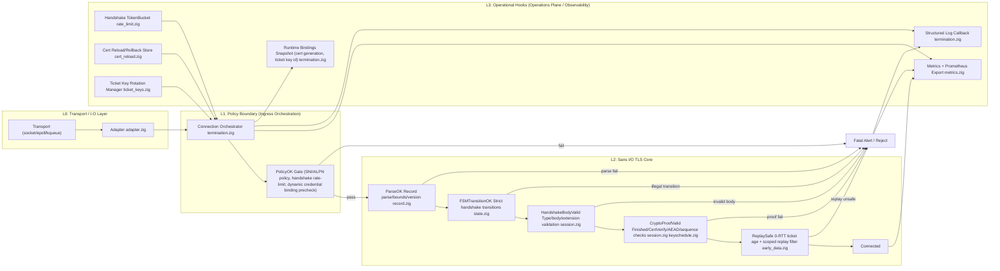

+++
title = 'Zig TLS 1.3 Implementation from Scratch'
date = 2026-02-23T23:30:26+09:00
draft = false
+++

# Zig TLS 1.3 Implementation from Scratch

This article covers the full implementation of a Zig TLS library designed to make TLS termination easy to integrate into any Zig project, primarily for my other project [zproxy](https://github.com/Geun-Oh/zproxy).

The full codebase is available [here](https://github.com/Geun-Oh/zigtls).
Feedback of any kind is welcome.

---

# Motivation

For roughly the past six months, I have been contributing to [HAProxy](https://haproxy.org) — a widely-used open source proxy — and studying the high-quality processing logic and techniques it uses to satisfy the demands of modern, large-scale distributed systems.

To contribute to deeper, lower-level parts of HAProxy, I needed to understand its core engine and codebase more thoroughly. I soon realized the best way to do that was to build my own implementation from scratch — that is how zproxy was born.

While implementing zproxy, I also needed TLS termination. There were no production-ready TLS termination libraries in the Zig ecosystem at the time, so I built zigtls. This article explains how I implemented it from scratch.

The zigtls objective was never “TLS works.” It was to **enforce, in code, that only security-meaningful connections can be established** through explicit state-machine and failure-model rules.

# Core Concepts

When I researched other TLS libraries before starting this implementation, the most important question was what a TLS library is fundamentally supposed to do. I treat a TLS library as a component that decides whether traffic should be admitted under strict security-policy enforcement, so I intentionally chose a pessimistic, conservative design over an optimistic one. In this project, the baseline policy is to prove "rejection" first, not "success," for any TLS connection.

The connection-establishment predicate can be written succinctly as follows.

`Connected = ParseOK AND PolicyOK AND FSMTransitionOK AND HandshakeBodyValid AND CryptoProofValid AND ReplaySafe`

If any one of these stages fails, the path immediately ends in a fatal alert or connection refusal.

# Overall Architecture

At a high level, the architecture consists of four layers: L0 (Transport I/O), L1 (Policy Boundary), L2 (TLS Core), and L3 (Operational Hooks).
The component interaction and dependency graph is shown below.



Broadly, L0–L2 form the data path, while the L3 (Operations Plane) handles operational management and cross-cutting concerns around that path.

The following sections examine each component and its responsibilities in detail.

## L0: Transport I/O Layer

This layer sits at the bottom of the stack and is designed to be swappable, allowing the library to be adapted to various runtime environments.

1. Socket I/O adaptation
2. Partial read/write handling
3. Buffering (accumulating bytes until a complete record is available before forwarding it to the next layer)

```zig
// src/adapter.zig
pub const TransportReadFn = *const fn (userdata: usize, out: []u8) anyerror!usize;
pub const TransportWriteFn = *const fn (userdata: usize, bytes: []const u8) anyerror!usize;

pub const Transport = struct {
    userdata: usize,
    read_fn: TransportReadFn,
    write_fn: TransportWriteFn,
};

pub const EventLoopAdapter = struct {
    const max_pending_read_bytes = (5 + tls13.record.max_ciphertext) * 4;

    conn: *termination.Connection,
    transport: Transport,
    pending_read_buf: [max_pending_read_bytes]u8 = undefined,
    pending_read_off: usize = 0,
    pending_read_len: usize = 0,
    pending_write_buf: [65_540]u8 = undefined,
    pending_write_len: usize = 0,
    pending_write_off: usize = 0,

    pub fn init(allocator: std.mem.Allocator, conn: *termination.Connection, transport: Transport) EventLoopAdapter {
        _ = allocator;
        return .{
            .conn = conn,
            .transport = transport,
        };
    }

    pub fn deinit(_: *EventLoopAdapter) void {}

...
};

```

In short, this layer does not make connection-establishment decisions, but it enforces baseline validation (such as record-length checks) to ensure only complete, well-formed records are forwarded.

## L1: Policy Boundary / Ingress Orchestration

Most of the logic lives in `termination.zig`, with the following responsibilities.

1. Policy decisions before engine entry

`ingest_tls_bytes` / `ingest_tls_bytes_with_alert` - ingress guard-chain implementation

```zig
// src/termination.zig
    pub fn ingest_tls_bytes(self: *Connection, record_bytes: []const u8) Error!tls13.session.IngestResult {
        if (!self.accepted) return error.NotAccepted;

        // Enforce handshake rate limit
        try self.enforceHandshakeRateLimit();

        // Record handshake start timestamp
        self.observeHandshakeStartIfNeeded();

        if (try self.inspectClientHelloAndCheckPolicy(record_bytes)) |alert_description| {
            // Policy rejected: send fatal alert
            try self.rejectClientHelloPolicy(alert_description);
            self.observeHandshakeFailureIfNeeded();
            return error.HandshakePolicyRejected;
        }

        // Bind dynamic credential
        try self.bindDynamicServerCredentialsIfNeeded();
        // Send record to next layer
        const result = self.engine.ingestRecord(record_bytes) catch |err| {
            self.observeHandshakeFailureIfNeeded();
            return err;
        };

        try self.collectActions(result);
        return result;
    }
```

> Key point: every decision is made _before_ `engine.ingestRecord()` is called, strictly in this order: `NotAccepted` check → rate limit → policy → dynamic credential binding.

2. ClientHello-based policy enforcement (SNI/ALPN required, allowlist)

`inspectClientHelloAndCheckPolicy` + `evaluateClientHelloPolicy`

Policy declaration:

```zig
pub const ClientHelloPolicy = struct {
    require_server_name: bool = false,
    require_alpn: bool = false,
    allowed_server_names: ?[]const []const u8 = null,
    allowed_alpn_protocols: ?[]const []const u8 = null,
};
```

```zig
// src/termination.zig
    fn inspectClientHelloAndCheckPolicy(
        self: *Connection,
        record_bytes: []const u8,
    ) Error!?tls13.alerts.AlertDescription {
        const parsed = tls13.record.parseRecord(record_bytes) catch return null;

        if (parsed.header.content_type != .handshake) return null;

        var cursor = parsed.payload;
        while (cursor.len > 0) {
            const hs = tls13.handshake.parseOne(cursor) catch return null;
            const frame_len = 4 + @as(usize, @intCast(hs.header.length));
            cursor = cursor[frame_len..];

            if (hs.header.handshake_type != .client_hello) continue;

            var hello = tls13.messages.ClientHello.decode(self.allocator, hs.body) catch |err| {
                if (err == error.OutOfMemory) return error.OutOfMemory;
                return null;
            };
            defer hello.deinit(self.allocator);

            // Parse ClientHello
            const meta = ClientHelloMetadata{
                .server_name = extractServerName(hello.extensions), // Extract SNI
                .alpn_protocol = extractFirstAlpn(hello.extensions), // Extract ALPN
            };
            self.captureClientHelloMetadata(meta);

            if (self.config.on_client_hello) |cb| cb(meta, self.config.callback_userdata);

            // Evaluate policy
            return self.evaluateClientHelloPolicy(meta);
        }
        return null;
    }

    fn evaluateClientHelloPolicy(
        self: Connection,
        meta: ClientHelloMetadata,
    ) ?tls13.alerts.AlertDescription {
        const policy = self.config.client_hello_policy;
        // Check mandatory SNI
        if (policy.require_server_name and meta.server_name == null) {
            return .unrecognized_name;
        }

        if (policy.allowed_server_names) |allowed| {
            const observed = meta.server_name orelse return .unrecognized_name;
            if (!containsServerName(allowed, observed)) return .unrecognized_name;
        }

        // Check mandatory ALPN
        if (policy.require_alpn and meta.alpn_protocol == null) {
            return .no_application_protocol;
        }

        if (policy.allowed_alpn_protocols) |allowed| {
            const observed = meta.alpn_protocol orelse return .no_application_protocol;
            if (!containsExactProtocol(allowed, observed)) return .no_application_protocol;
        }

        return null;
    }

```

3. Handshake rate-limit enforcement

`enforceHandshakeRateLimit`

Token-bucket rate-limiting design

```zig
// src/termination.zig
handshake_rate_limiter: ?*rate_limit.TokenBucket = null,

    fn enforceHandshakeRateLimit(self: *Connection) Error!void {
        // Ignore sessions which are already connected
        if (self.engine.machine.state == .connected) return;

        const limiter = self.config.handshake_rate_limiter orelse return;

        if (!limiter.allowAt(self.nowNs())) return error.HandshakeRateLimited;
    }
```

4. Runtime binding for dynamic certificates/ticket keys

`bindDynamicServerCredentialsIfNeeded` - dynamic certificate refresh logic

```zig
// src/termination.zig
    fn bindDynamicServerCredentialsIfNeeded(self: *Connection) Error!void {
        const dyn = self.config.dynamic_server_credentials orelse return;

        if (self.config.session.role != .server) return error.InvalidConfiguration;

        const snap = dyn.store.snapshot() orelse return error.NoActiveSnapshot;

        if (self.dynamic_cert_generation) |gen| {
            // Skip if credential is already latest
            if (gen == snap.generation) return;
        }

        if (self.dynamic_cert_chain) |*chain| {
            chain.deinit(self.allocator);
            self.dynamic_cert_chain = null;
        }
        if (self.dynamic_ed25519_bundle) |*bundle| {
            bundle.deinit(self.allocator);
            self.dynamic_ed25519_bundle = null;
        }

        // Evict cached credentials and load the new certificate
        self.dynamic_cert_generation = snap.generation;
        if (dyn.auto_sign_from_store_ed25519) {
            const bundle = try dyn.store.loadActiveEd25519Bundle(self.allocator);
            self.dynamic_ed25519_bundle = bundle;
            self.engine.config.server_credentials = self.dynamic_ed25519_bundle.?.serverCredentials();
            return;
        }

        const chain = try dyn.store.decodeActiveCertificateChainDer(self.allocator);
        self.dynamic_cert_chain = chain;

        const sign_fn = dyn.sign_certificate_verify orelse return error.InvalidConfiguration;

        self.engine.config.server_credentials = .{
            .cert_chain_der = self.dynamic_cert_chain.?.certs,
            .signature_scheme = dyn.signature_scheme,
            .sign_certificate_verify = sign_fn,
            .signer_userdata = dyn.signer_userdata,
        };
    }
```

`captureRuntimeBindings` — records which certificate generation and ticket key were active when the handshake completed

```zig
    fn captureRuntimeBindings(self: *Connection) void {
        // Record active certificate generation
        if (self.dynamic_cert_generation) |gen| {
            self.active_cert_generation = gen;
        } else if (self.config.cert_store) |store| {
            if (store.snapshot()) |snap| {
                self.active_cert_generation = snap.generation;
            }
        }

        // Record active ticket key ID
        if (self.config.ticket_key_manager) |manager| {
            const key = manager.currentEncryptKey(self.nowUnix()) catch return;
            self.active_ticket_key_id = key.key_id;
        }
    }
```

5. Immediate promotion of failures to fatal alerts

`rejectClientHelloPolicy` - send policy rejections as fatal alerts

```zig
src/termination.zig
    fn rejectClientHelloPolicy(self: *Connection, alert_description: tls13.alerts.AlertDescription) Error!void {
        self.telemetry.observeAlert(@intFromEnum(alert_description));
        self.emitLog(.alert_sent, alert_description);
        const frame = tls13.session.Engine.buildAlertRecord(.{
            .level = .fatal,
            .description = alert_description,
        });
        try self.pushPendingRecord(frame[0..]);
    }
```

In `ingest_tls_bytes_with_alert`, a policy rejection surfaces directly as a `.fatal` result.

```zig
// src/termination.zig
        if (try self.inspectClientHelloAndCheckPolicy(record_bytes)) |alert_description| {
            try self.rejectClientHelloPolicy(alert_description);
            self.observeHandshakeFailureIfNeeded();
            return .{
                .fatal = .{
                    .err = error.HandshakePolicyRejected,
                    .alert = .{ .level = .fatal, .description = alert_description },
                },
            };
        }
```

The end-to-end flow is summarized below.

```
ingest_tls_bytes[\_with_alert]()
│
├─ [1] if !accepted -> NotAccepted (pre-engine guard)
├─ [3] enforceHandshakeRateLimit() (rate limiting)
├─ [2] inspectClientHelloAndCheckPolicy() (SNI/ALPN policy evaluation)
│ └─ evaluateClientHelloPolicy()
│ ├─ require_server_name / allowlist
│ └─ require_alpn / allowlist
├─ [5] rejectClientHelloPolicy() -> fatal alert (immediate fatal promotion)
├─ [4] bindDynamicServerCredentialsIfNeeded() (dynamic certificate binding)
└─ engine.ingestRecord() (engine entry)
```

## L2: Sans I/O TLS Core

This layer follows a Sans I/O design: all TLS logic is isolated from network I/O concerns (socket reads/writes, `epoll`/`kqueue`, timeouts). The core behavior is spread across `record.zig`, `state.zig`, `session.zig`, `keyschedule.zig`, and `early_data.zig`.

The overall structure is:

- **Input**: raw bytes and events
- **Core engine**: parsing, state propagation, cryptographic validation, policy enforcement
- **Output**: "next actions" (e.g., send alert, emit handshake flight, change FSM state)

The sections below explain each connection-validation stage.

### `ParseOK` - Record format/length/boundary validation

Parsing is split into two layers.

- Record layer: `record.zig`
- Handshake-frame layer: `handshake.zig`

TLS record-header parsing

```
// src/tls13/record.zig
pub const ParseError = error{
    IncompleteHeader, // buffer < 5 Bytes
    InvalidContentType, // Unknown ContnetType Byte
    InvalidLegacyVersion, // Out of range 0x0301 ~ 0x0303
    RecordOverflow, // Payload > 16KB + 256(overhead)
    IncompletePayload, // Data not received for the length declared in the header
};

pub fn parseHeader(buf: []const u8) ParseError!Header {
    if (buf.len < 5) return error.IncompleteHeader;

    const content_type = std.meta.intToEnum(ContentType, buf[0]) catch return error.InvalidContentType;
    const legacy_version = std.mem.readInt(u16, buf[1..3], .big);

    if (!isAcceptedLegacyRecordVersion(legacy_version)) return error.InvalidLegacyVersion; // Deny 0x0304 (TLS 1.3 wire)

    const len = std.mem.readInt(u16, buf[3..5], .big);

    if (len > max_ciphertext) return error.RecordOverflow; // Overflowed 16KB + 256 overhead

    return .{
        .content_type = content_type,
        .legacy_version = legacy_version,
        .length = len,
    };
}

pub fn parseRecord(buf: []const u8) ParseError!ParsedRecord {
    const header = try parseHeader(buf);
    const needed = 5 + @as(usize, header.length);

    if (buf.len < needed) return error.IncompletePayload; // Restricted Validation

    return .{
        .header = header,
        .payload = buf[5..needed],
        .rest = buf[needed..],
    };
}
```

Handshake-frame parsing

```zig
// src/tls13/handshake.zig
pub const ParseError = error{
    IncompleteHeader, // Handshake header is less then 4 Bytes
    InvalidHandshakeType, // Unregistered type Byte
    MessageTooLarge, // Exceeded 64KB
    IncompleteBody, // Data not received for the length declared in the header
};

pub fn parseOne(bytes: []const u8) ParseError!ParsedHandshake {
    const header = try parseHeader(bytes);
    const len: usize = @intCast(header.length);
    const total = 4 + len;

    if (bytes.len < total) return error.IncompleteBody; // Boundary Validation

    return .{
        .header = header,
        .body = bytes[4..total],
        .rest = bytes[total..],
    };
}
```

> Validation proceeds in this order: `parseRecord` (fixed 5-byte header + version + length checks) → `parseOne` (4-byte handshake header + 64 KB limit). This two-layer pipeline enforces all record and frame boundaries. A failure at any stage maps immediately to a `decode_error`-class alert.

### `FSMTransitionOK` - FSM-based message-order validation

This stage validates that handshake messages arrive in a legal order under the FSM.

- If the event is present in the transition table for the current state, it passes; otherwise it fails immediately.
- The state machine is implemented in `state.zig` (`Machine.init`, `Machine.onEvent`, `onClientHandshake`, `onServerHandshake`).
- Failure remapping into protocol-meaningful alerts is handled by `classifyErrorAlert` in `session.zig`.
- For a client in `wait_server_hello`, only a constrained event set is legal (for example `server_hello` or HRR).
- If `certificate` arrives first in that state, it is absent from the transition table and is rejected immediately.

State-machine definition

```zig
// src/tls13/state.zig
pub const ConnectionState = enum {
    start,
    wait_server_hello,
    wait_encrypted_extensions,
    wait_server_certificate,
    wait_server_certificate_verify,
    wait_server_finished,
    wait_client_certificate_or_finished,
    wait_client_certificate_verify,
    wait_client_finished_after_cert,
    connected,
    closing,
    closed,
};

pub const Machine = struct {
    role: Role,
    state: ConnectionState,

    pub fn init(role: Role) Machine {
        return .{
            .role = role,
            .state = switch (role) {
                .client => .wait_server_hello,
                .server => .start,
            },
        };
    }

    ...

    pub fn onEvent(self: *Machine, event: HandshakeEvent) TransitionError!void {
        switch (self.role) {
            .client => try onClientHandshake(self, event),
            .server => try onServerHandshake(self, event),
        }
    }

...
};
```

Client transition table

```zig
// src/tls13/state.zig
fn onClientHandshake(self: *Machine, event: HandshakeEvent) TransitionError!void {
    switch (self.state) {
        .wait_server_hello => switch (event) {
            .server_hello => self.state = .wait_encrypted_extensions,
            .hello_retry_request => {},
            else => return error.IllegalTransition,
        },
        .wait_encrypted_extensions => if (event == .encrypted_extensions) {
            self.state = .wait_server_certificate;
        } else {
            return error.IllegalTransition;
        },
        .wait_server_certificate => switch (event) {
            .certificate => self.state = .wait_server_certificate_verify,
            .finished => self.state = .connected,
            else => return error.IllegalTransition,
        },
        .wait_server_certificate_verify => if (event == .certificate_verify) {
            self.state = .wait_server_finished;
        } else {
            return error.IllegalTransition;
        },
        .wait_server_finished => if (event == .finished) {
            self.state = .connected;
        } else {
            return error.IllegalTransition;
        },
        .connected => switch (event) {
            .new_session_ticket, .key_update => {},
            else => return error.IllegalTransition,
        },
        else => return error.IllegalTransition,
    }
}
```

## Authentication and Trust Path

The previous sections explain handshake gating, state transitions, and cryptographic proof checks.  
For production semantics, zigtls also implements a strict authentication/trust path: certificate-chain policy, hostname checks, and OCSP verification.

### Certificate Policy and Hostname Validation

`src/tls13/certificate_validation.zig` encodes explicit, testable rules for:

- chain depth and CA bit constraints
- `keyCertSign` and path-length constraints on intermediates
- DNS name constraints (`permitted` / `excluded` suffixes)
- leaf usage requirements (`digital_signature`, `server_auth` / `client_auth`)
- hostname matching and wildcard restrictions

```zig
// src/tls13/certificate_validation.zig
pub const ValidationPolicy = struct {
    allow_expired: bool = false,
    allow_soft_fail_ocsp: bool = false,
};

pub const ValidationError = error{
    EmptyServerName,
    HostnameMismatch,
    InvalidChain,
    ChainTooLong,
    LeafMustNotBeCa,
    IntermediateNotCa,
    IntermediateMissingKeyCertSign,
    PathLenExceeded,
    NameConstraintsViolation,
    LeafMissingDigitalSignature,
    LeafMissingServerAuthEku,
    LeafMissingClientAuthEku,
} || ocsp.CheckError;

pub fn validateServerPeer(input: PeerValidationInput) ValidationError!PeerValidationResult {
    try validateServerChain(input.chain);
    try validateServerName(input.expected_server_name, input.chain[0].dns_name);

    const ocsp_result = try validateStapledOcsp(input.stapled_ocsp, input.now_sec, input.policy);
    return .{ .ocsp_result = ocsp_result };
}

fn validateCaPathAndNameConstraints(chain: []const CertificateView) ValidationError!void {
    const leaf = chain[0];
    if (leaf.dns_name.len > 0) {
        try validateNameConstraints(leaf.dns_name, chain[1..]);
    }

    for (chain[1..], 0..) |cert, idx| {
        if (!cert.is_ca) return error.IntermediateNotCa;

        if (!cert.key_usage.key_cert_sign) return error.IntermediateMissingKeyCertSign;

        if (cert.path_len_constraint) |limit| {
            const below = (chain.len - 2) - idx;
            if (below > limit) return error.PathLenExceeded;
        }
    }
}
```

Operationally, this means certificate acceptance is not a single boolean check. It is a sequence of fail-closed predicates over identity, usage, and chain topology.

### OCSP Stapling: Hard-Fail vs Soft-Fail

OCSP handling is modeled explicitly in `src/tls13/ocsp.zig`. The implementation distinguishes strict rejection from policy-tolerant soft-fail behavior.

```zig
// src/tls13/ocsp.zig
pub const ValidationResult = enum {
    accepted,
    soft_fail,
};

pub const CheckError = error{
    MissingResponse,
    Revoked,
    UnknownStatus,
    FutureProducedAt,
    ProducedBeforeThisUpdate,
    FutureThisUpdate,
    InvalidTimeWindow,
    StaleResponse,
};

pub fn checkStapled(response: ?ResponseView, now_sec: i64, allow_soft_fail: bool) CheckError!ValidationResult {
    const resp = response orelse {
        if (allow_soft_fail) return .soft_fail;

        return error.MissingResponse;
    };

    switch (resp.status) {
        .good => {},
        .revoked => return error.Revoked,
        .unknown => {
            if (allow_soft_fail) return .soft_fail;

            return error.UnknownStatus;
        },
    }

    // produced_at / this_update / next_update skew-window checks...
    return .accepted;
}
```

This policy split is important in real deployments: some environments require hard revocation guarantees, while others need availability-oriented soft-fail behavior under responder outages.

### Trust Store Strategy and Deterministic Fallback

Trust anchor loading is isolated in `src/tls13/trust_store.zig`.  
The API enforces absolute-path guardrails and deterministic source selection.

```zig
// src/tls13/trust_store.zig
pub const LoadStrategy = struct {
    prefer_system: bool = true,
    fail_on_system_error: bool = false,
    fallback_pem_file_absolute: ?[]const u8 = null,
    fallback_pem_dir_absolute: ?[]const u8 = null,
};

pub const LoadResult = enum {
    system,
    pem_file,
    pem_dir,
    none,
};

pub fn loadWithStrategy(self: *TrustStore, allocator: std.mem.Allocator, strategy: LoadStrategy) !LoadResult {
    return self.loadWithStrategyInternal(allocator, strategy, defaultSystemLoader);
}

fn loadWithStrategyInternal(
    self: *TrustStore,
    allocator: std.mem.Allocator,
    strategy: LoadStrategy,
    system_loader: SystemLoaderFn,
) !LoadResult {
    if (strategy.fallback_pem_file_absolute != null and strategy.fallback_pem_dir_absolute != null) {
        return error.AmbiguousFallbackSource;
    }

    if (strategy.prefer_system) {
        system_loader(self, allocator) catch |err| {
            if (strategy.fail_on_system_error) return err;
        };

        if (self.count() > 0) return .system;
    }

    if (strategy.fallback_pem_file_absolute) |path| {
        try self.loadPemFileAbsolute(allocator, path);

        if (self.count() > 0) return .pem_file;
    }

    if (strategy.fallback_pem_dir_absolute) |path| {
        try self.loadPemDirAbsolute(allocator, path);

        if (self.count() > 0) return .pem_dir;
    }

    return .none;
}
```

This keeps trust-source behavior predictable under partial failures and prevents ambiguous mixed fallback configuration.

## Alert Taxonomy and Wire Semantics

Alert definitions are centralized in `src/tls13/alerts.zig`, including strict length and enum validation on decode.

```zig
// src/tls13/alerts.zig
pub const AlertLevel = enum(u8) {
    warning = 1,
    fatal = 2,
};

pub const AlertDescription = enum(u8) {
    close_notify = 0,
    unexpected_message = 10,
    decode_error = 50,
    decrypt_error = 51,
    internal_error = 80,
    no_application_protocol = 120,
    // ...
};

pub fn decode(bytes: []const u8) DecodeError!Alert {
    if (bytes.len != 2) return error.InvalidLength;

    const level = std.meta.intToEnum(AlertLevel, bytes[0]) catch return error.InvalidLevel;
    const description = std.meta.intToEnum(AlertDescription, bytes[1]) catch return error.InvalidDescription;

    return .{ .level = level, .description = description };
}
```

In `session.zig`, internal errors are classified into this alert model, providing a stable wire-level failure contract.

## Verification Evidence: Fuzz and Corpus Replay

Beyond unit validation, zigtls includes fuzz-style stress tests and corpus replay tooling:

1. random-input parser/session resilience tests in `src/tls13/fuzz.zig`
2. persistent regression corpus under `tests/fuzz/corpus`
3. automated replay script `scripts/fuzz/replay_corpus.sh`

```zig
// src/tls13/fuzz.zig
test "record parser fuzz-style random inputs do not crash" {
    var prng = std.Random.DefaultPrng.init(0xdeadbeefcafebabe);
    const rnd = prng.random();

    var buf: [256]u8 = undefined;
    var i: usize = 0;
    while (i < 5_000) : (i += 1) {
        const len = rnd.intRangeAtMost(usize, 0, buf.len);
        rnd.bytes(buf[0..len]);
        _ = record.parseRecord(buf[0..len]) catch {};
    }
}
```

```bash
# scripts/fuzz/replay_corpus.sh
zig test src/tls13/fuzz.zig >/dev/null
zig build corpus-replay >/dev/null
"$replay_bin" "$bucket" "$file" >/dev/null
```

```text
# tests/fuzz/corpus/README.md
- record/invalid-legacy-version.bin
- handshake/truncated-serverhello.bin
- session/downgrade-tls12-marker.bin
- session/downgrade-tls11-marker.bin
```

Together, these layers turn parser robustness from a one-time claim into a replayable, regression-protected contract.

> Example: if `certificate` arrives before `server_hello` in `wait_server_hello`, no legal transition exists, so execution immediately falls through `else => return error.IllegalTransition`.

FSM invocation point

```zig
// src/tls13/session.zig
    fn ingestHandshakePayload(self: *Engine, payload: []const u8, result: *IngestResult) EngineError!void {
        var cursor = payload;
        while (cursor.len > 0) {
            const frame = try handshake.parseOne(cursor);
            const frame_len = 4 + @as(usize, @intCast(frame.header.length));

            try self.validateHandshakeBody(frame.header.handshake_type, frame.body);
            self.transcript.update(cursor[0..frame_len]);
            self.metrics.handshake_messages += 1;

            const prev_state = self.machine.state;
            const event = handshake.classifyEvent(frame);

            // FSMTransitionOK Check!
            try self.machine.onEvent(event);

            ...
        }
    }
```

Error -> alert mapping

```zig
// src/tls13/session.zig
pub fn classifyErrorAlert(err: anyerror) alerts.Alert {
    const description: alerts.AlertDescription = switch (err) {
        // FSM Transition Failed → unexpected_message
        error.IllegalTransition, error.UnsupportedRecordType => .unexpected_message,

        // Parse Failed → decode_error
        error.InvalidHandshakeType,
        error.InvalidHelloMessage,
        error.InvalidFinishedMessage,

        // ...
        => .decode_error,

        // Decryption Failed → decrypt_error
        error.DecryptFailed => .decrypt_error,

        else => .internal_error,
    };

    return .{ .level = .fatal, .description = description };
}
```

> #### TLS 1.3 as a partial DFA (**Deterministic Finite Automaton**)
>
> TLS 1.3 is specified in RFC 8446. It normatively defines message order, required/optional messages, and abort behavior on errors, which effectively forces implementations into an FSM form. More precisely, this is a partial DFA: only allowed transitions are defined. Branches such as HRR, PSK, and optional client certificates are modeled as explicit branch states.
>
> **Formal Definition (Role-Partitioned Partial DFA)**
>
> The state machine for each role can be defined as follows.
>
> - Client machine: `M_c = (Q_c, Σ, δ_c, q0_c, F_c)`
> - Server machine: `M_s = (Q_s, Σ, δ_s, q0_s, F_s)`
>
> Shared elements are:
>
> - `Σ` (input-event set):
>   `{client_hello, server_hello, hello_retry_request, encrypted_extensions, certificate, certificate_verify, finished, new_session_ticket, key_update, message_hash}`
> - `δ` (partial transition function):
>   `δ: Q × Σ ⇀ Q` (not defined for every `(state, event)` pair)
> - Any undefined input fails as `IllegalTransition`.
>
> The key property of TLS 1.3 implementations is this: proceed only when a transition exists; otherwise fall immediately into an abort path. That is exactly the behavior of a partial DFA.
>
> ---
>
> **State Set (`Q`)**
>
> In code, the state set is:
>
> - `start`
> - `wait_server_hello`
> - `wait_encrypted_extensions`
> - `wait_server_certificate`
> - `wait_server_certificate_verify`
> - `wait_server_finished`
> - `wait_client_certificate_or_finished`
> - `wait_client_certificate_verify`
> - `wait_client_finished_after_cert`
> - `connected`
> - `closing`
> - `closed`
>
> Source: `src/tls13/state.zig` (`ConnectionState`, `Machine`)
>
> ---
>
> **Initial and Accepting States**
>
> - Client initial state: `q0_c = wait_server_hello`
> - Server initial state: `q0_s = start`
> - Effective handshake accepting state: `connected`
>
> `connected` acts as the gateway state meaning "handshake complete + application-data path enabled."
>
> ---
>
> **Client Automaton (`δ_c`)**
>
> Allowed transitions are summarized below.
>
> - `wait_server_hello --server_hello--> wait_encrypted_extensions`
> - `wait_server_hello --hello_retry_request--> wait_server_hello` (self-loop)
> - `wait_encrypted_extensions --encrypted_extensions--> wait_server_certificate`
> - `wait_server_certificate --certificate--> wait_server_certificate_verify`
> - `wait_server_certificate --finished--> connected` (PSK-like no-cert path)
> - `wait_server_certificate_verify --certificate_verify--> wait_server_finished`
> - `wait_server_finished --finished--> connected`
> - `connected --{new_session_ticket,key_update}--> connected` (post-handshake only)
>
> Any input outside the transitions above results in `IllegalTransition`.
>
> ---
>
> **Server Automaton (`δ_s`)**
>
> - `start --client_hello--> wait_client_certificate_or_finished`
> - `wait_client_certificate_or_finished --certificate--> wait_client_certificate_verify`
> - `wait_client_certificate_or_finished --finished--> connected` (no client cert path)
> - `wait_client_certificate_verify --certificate_verify--> wait_client_finished_after_cert`
> - `wait_client_finished_after_cert --finished--> connected`
> - `connected --{new_session_ticket,key_update}--> connected`
>
> Any input outside the transitions above results in `IllegalTransition`.
>
> Source: `src/tls13/state.zig` (`onClientHandshake`, `onServerHandshake`)
>
> ---
>
> **Event-Generation Rule (`HandshakeType -> HandshakeEvent`)**
>
> On the wire, inputs arrive as `HandshakeType` values in handshake frames. Runtime events are generated by the following rules.
>
> 1. Base rule: one-to-one mapping via `fromHandshakeType(type)`
> 2. Exception rule: if the type is `server_hello` and the random equals the HRR marker, reclassify to `hello_retry_request`
>
> Therefore, the FSM consumes semantic events, not raw handshake types.
>
> Source: `src/tls13/handshake.zig` (`classifyEvent`, `hello_retry_request_random`)
>
> ---
>
> **Runtime Execution Order**
>
> In the engine loop, transitions execute in this order.
>
> 1. Parse frame via `parseOne`
> 2. Validate type-specific body/extensions via `validateHandshakeBody`
> 3. Update transcript via `transcript.update`
> 4. Classify event via `classifyEvent`
> 5. Apply state transition via `machine.onEvent(event)`
> 6. Process key schedule / flight queue / post-handshake actions based on the transition result
>
> Critical property: **validation runs before transition**. A message that fails body validation never enters the state machine.
>
> Source: `src/tls13/session.zig` (`ingestHandshakePayload`)
>
> ---
>
> **Extended Transitions Including Terminal States (`closing`, `closed`)**
>
> The handshake DFA itself ends at `connected`, but the engine adds terminal-state transitions using alerts/EOF.
>
> - On alert reception:
>   - `close_notify` -> `closed`
>   - Other fatal/warning alerts -> `closing`
> - transport EOF:
>   - EOF without `close_notify` -> `TruncationDetected` (fail-closed)
>   - EOF after observing `close_notify` -> `closed`
>
> Source: `src/tls13/session.zig` (`ingestRecord`, `onTransportEof`)

### `HandshakeBodyValid` - Message Type/Body/Extension-Structure Validation

```zig
// src/tls13/session.zig
    fn validateHandshakeBody(self: *Engine, handshake_type: state.HandshakeType, body: []const u8) EngineError!void {
        switch (handshake_type) {
            .server_hello => {
                // Validate Body
                var sh = messages.ServerHello.decode(self.allocator, body) catch return error.InvalidHelloMessage;
                defer sh.deinit(self.allocator);

                // Detect Downgrade
                if (self.config.role == .client and hasDowngradeMarker(sh.random)) {
                    return error.DowngradeDetected;
                }

                if (self.config.role == .client) {
                    if (sh.compression_method != 0x00) return error.InvalidCompressionMethod;

                    // Validate CipherSuite (Extension Structure)
                    if (sh.cipher_suite != configuredCipherSuiteCodepoint(self.config.suite)) {
                        return error.ConfiguredCipherSuiteMismatch;
                    }

                    if (messages.serverHelloHasHrrRandom(body)) {
                        try self.requireHrrExtensions(sh.extensions);
                    } else {
                        try self.requireServerHelloExtensions(sh.extensions);
                        try self.bindClientKeyExchangeSecret(sh.extensions);
                    }
                }
            },
            .client_hello => {
                var ch = messages.ClientHello.decode(self.allocator, body) catch return error.InvalidHelloMessage;
                defer ch.deinit(self.allocator);

                if (self.config.role == .server) {
                    // Validate all the mandatory extension (SNI, key_share, supported_versions...etc)
                    if (!containsCipherSuite(ch.cipher_suites, configuredCipherSuiteCodepoint(self.config.suite))) {
                        return error.ConfiguredCipherSuiteMismatch;
                    }

                    try self.requireClientHelloExtensions(ch.compression_methods, ch.extensions);
                }
            },
            .certificate => {
                var cert = messages.CertificateMsg.decode(self.allocator, body) catch return error.InvalidCertificateMessage;
                defer cert.deinit(self.allocator);

                try self.capturePeerLeafCertificate(cert);

                // Enforce certificate chain policy
                try self.validatePeerCertificatePolicy(cert);
            },
            .certificate_verify => {
                var cert_verify = messages.CertificateVerifyMsg.decode(self.allocator, body) catch return error.InvalidCertificateVerifyMessage;
                defer cert_verify.deinit(self.allocator);

                if (!self.isAllowedSignatureAlgorithm(cert_verify.algorithm)) {
                    return error.UnsupportedSignatureAlgorithm;
                }

                if (self.config.peer_validation.enforce_certificate_verify) {
                    try self.verifyPeerCertificateVerify(cert_verify.algorithm, cert_verify.signature);
                }
            },
            .finished => {
                // Validate Finished MAC length + HMAC validation
                if (body.len != keyschedule.digestLen(self.config.suite)) {
                    return error.InvalidFinishedMessage;
                }

                // ...
            },
            .encrypted_extensions => {
                var ee = messages.EncryptedExtensions.decode(self.allocator, body) catch return error.InvalidEncryptedExtensionsMessage;
                defer ee.deinit(self.allocator);
            },
            .new_session_ticket => {
                var nst = messages.NewSessionTicketMsg.decode(self.allocator, body) catch return error.InvalidNewSessionTicketMessage;
                defer nst.deinit(self.allocator);
            },
            else => {},
        }
    }
```

> Because `validateHandshakeBody` runs before the FSM transition, a message that fails body validation never advances the state machine.

### `CryptoProofValid` - Finished/CertVerify/AEAD/Sequence Validation

Finished HMAC validation

```zig
// src/tls13/session.zig:1809~1850
.finished => {
                // Length Validation
                if (body.len != keyschedule.digestLen(self.config.suite)) {
                    return error.InvalidFinishedMessage;
                }

                if (self.config.role == .server and self.peerCertificateIsRequired() and !self.saw_peer_certificate) {
                    return error.MissingPeerCertificate;
                }

                // HMAC(finished_key, transcript_hash) Validation
                if (self.config.role == .server and self.config.server_credentials != null and self.handshake_read_secret != null) {
                    const hs_secret = self.handshake_read_secret.?;
                    const ok = switch (self.config.suite) {
                        .tls_aes_128_gcm_sha256 => switch (hs_secret) {
                            .sha256 => |secret| blk: {
                                const transcript_hash = self.transcriptDigestSha256();
                                const fin_key = keyschedule.finishedKey(.tls_aes_128_gcm_sha256, secret);
                                break :blk keyschedule.verifyFinished(.tls_aes_128_gcm_sha256, fin_key, &transcript_hash, body);
                            },
                            .sha384 => false,
                        },
                        .tls_chacha20_poly1305_sha256 => switch (hs_secret) {
                            .sha256 => |secret| blk: {
                                const transcript_hash = self.transcriptDigestSha256();
                                const fin_key = keyschedule.finishedKey(.tls_chacha20_poly1305_sha256, secret);
                                break :blk keyschedule.verifyFinished(.tls_chacha20_poly1305_sha256, fin_key, &transcript_hash, body);
                            },
                            .sha384 => false,
                        },
                        .tls_aes_256_gcm_sha384 => switch (hs_secret) {
                            .sha256 => false,
                            .sha384 => |secret| blk: {
                                const transcript_hash = self.transcriptDigestSha384();
                                const fin_key = keyschedule.finishedKey(.tls_aes_256_gcm_sha384, secret);
                                break :blk keyschedule.verifyFinished(.tls_aes_256_gcm_sha384, fin_key, &transcript_hash, body);
                            },
                        },
                    };

                    if (!ok) return error.InvalidFinishedMessage;
                }
            },
```

AEAD decryption + Sequence number

```zig
// src/tls13/session.zig
    fn decryptConnectedApplicationData(
        self: *Engine,
        header: record.Header,
        payload: []const u8,
        result: *IngestResult,
    ) EngineError!void {
        try self.ensureApplicationTrafficReady();

        if (payload.len < self.app_tag_len + 1) return error.DecryptFailed;

        const ciphertext_len = payload.len - self.app_tag_len;

        if (ciphertext_len > self.app_data_scratch.len) return error.RecordOverflow;

        const ciphertext = payload[0..ciphertext_len];
        var tag: [16]u8 = undefined;
        @memcpy(&tag, payload[ciphertext_len..]);

        // nonce = base_iv XOR seq (RFC 8446 §5.3)
        const nonce = buildTls13Nonce(self.app_read_iv, self.app_read_seq);
        const ad = header.encode(); // AAD = TLS Record Header

        switch (self.config.suite) {
            .tls_aes_128_gcm_sha256 => {
                const key = self.app_read_key[0..16].*;
                std.crypto.aead.aes_gcm.Aes128Gcm.decrypt(self.app_data_scratch[0..ciphertext_len], ciphertext, tag, &ad, nonce, key) catch return error.DecryptFailed; // Failed AEAD Validation
            },
            // ... same pattern at AES-256-GCM, ChaCha20-Poly1305
        }

        // Monotonically increment the sequence number; overflow yields SequenceOverflow
        self.app_read_seq = std.math.add(u64, self.app_read_seq, 1) catch return error.SequenceOverflow;
        const inner = std.mem.trimRight(u8, self.app_data_scratch[0..ciphertext_len], "\x00");

        if (inner.len == 0) return error.InvalidInnerContentType;

        const inner_type = std.meta.intToEnum(record.ContentType, inner[inner.len - 1]) catch return error.InvalidInnerContentType;
        const clear = inner[0 .. inner.len - 1];

        switch (inner_type) {
            .application_data => {
                try result.push(.{ .application_data = clear });
            },
            .alert => {
                const alert = try alerts.Alert.decode(clear);
                self.metrics.alerts_received += 1;

                try result.push(.{ .received_alert = alert });

                if (alert.description == .close_notify) {
                    self.saw_close_notify = true;
                    self.machine.markClosed();
                } else {
                    self.machine.markClosing();
                }

                try result.push(.{ .state_changed = self.machine.state });
            },
            .handshake => try self.ingestHandshakePayload(clear, result),
            else => return error.InvalidInnerContentType,
        }
    }

// Generate nonce: base_iv XOR big-endian(seq)
fn buildTls13Nonce(base_iv: [12]u8, seq: u64) [12]u8 {
    var nonce = base_iv;
    var seq_bytes: [8]u8 = undefined;
    std.mem.writeInt(u64, &seq_bytes, seq, .big);
    // XOR only the lower 8 bits
    var i: usize = 0;
    while (i < seq_bytes.len) : (i += 1) {
        nonce[nonce.len - seq_bytes.len + i] ^= seq_bytes[i];
    }
    return nonce;
}
```

> AEAD monotonically increments `seq` to prevent nonce reuse. If the authentication tag differs by even a single bit, decryption fails with `DecryptFailed`, which maps to a `decrypt_error` alert.

### `ReplaySafe` - 0-RTT Replay-Safety Validation

This stage deterministically enforces the predicates required for 0-RTT early-data admission.

Ingress predicate gate

```zig
//src/tls13/session.zig:395~417
            .application_data => {
                if (self.machine.state == .connected) {
                    // Normal decrypt path
                    try self.decryptConnectedApplicationData(parsed.header, parsed.payload, &result);
                } else {
                    if (self.hs_key_len != 0) {
                        // Handshake decrypt path
                        try self.decryptHandshakeApplicationData(parsed.header, parsed.payload, &result);
                    } else {
                        // 0-RTT early data path: should pass 5 predicates
                        if (self.config.role != .server) return error.EarlyDataRejected;

                        if (!self.config.early_data.enabled) return error.EarlyDataRejected;

                        if (!self.early_data_idempotent) return error.EarlyDataRejected;

                        if (!self.early_data_within_window) return error.EarlyDataTicketExpired;

                        if (!self.early_data_admitted) {
                            const replay_filter = self.config.early_data.replay_filter orelse return error.MissingReplayFilter;
                            const ticket = self.early_data_ticket orelse return error.EarlyDataRejected;
                            const scope: early_data.ReplayScopeKey = .{
                                .node_id = self.config.early_data.replay_node_id,
                                .epoch = self.config.early_data.replay_epoch,
                            };

                            // seenOrInsertScoped: If the same (scope, ticket) combination already exists, it is determined to be a replay
                            if (replay_filter.seenOrInsertScoped(scope, ticket)) return error.EarlyDataRejected;
                            self.early_data_admitted = true;
                        }
                        try result.push(.{ .application_data = parsed.payload });
                    }
                }
            },
```

Replay Filter (Bloom Filter)

```zig
// src/tls13/early_data.zig
pub const ReplayFilter = struct {
    allocator: std.mem.Allocator, // bitmap (power-of-2 restriction)
    words: []u64,
    bit_count: usize,

    // ...

    // 3 independent hashes (different Wyhash seeds) → If all are set, 'seen'
    pub fn seenOrInsertScoped(self: *ReplayFilter, scope: ReplayScopeKey, token: []const u8) bool {
        const idx0 = self.indexScoped(0x91e10da5c79e7b1d, scope, token);
        const idx1 = self.indexScoped(0xd6e8feb86659fd93, scope, token);
        const idx2 = self.indexScoped(0xa0761d6478bd642f, scope, token);

        const seen = self.isSet(idx0) and self.isSet(idx1) and self.isSet(idx2);
        self.set(idx0);
        self.set(idx1);
        self.set(idx2);
        return seen;
    }

    // ...

    // scope = (node_id, epoch) → Isolation between nodes and epochs
    fn indexScoped(self: ReplayFilter, seed: u64, scope: ReplayScopeKey, token: []const u8) usize {
        var scope_bytes: [12]u8 = undefined;
        std.mem.writeInt(u32, scope_bytes[0..4], scope.node_id, .big);
        std.mem.writeInt(u64, scope_bytes[4..12], scope.epoch, .big);

        var hasher = std.hash.Wyhash.init(seed);
        hasher.update(&scope_bytes);
        hasher.update(token);
        const h = hasher.final();
        return @as(usize, @intCast(h)) & (self.bit_count - 1);
    }
};
```

Time-window check

```zig
// src/tls13/session.zig
    pub fn beginEarlyData(self: *Engine, ticket: []const u8, idempotent: bool) !void {
        if (ticket.len > self.config.early_data.max_ticket_len) return error.EarlyDataTicketTooLarge;

        self.clearEarlyDataTicket();
        self.early_data_ticket = try self.allocator.alloc(u8, ticket.len);
        @memcpy(self.early_data_ticket.?, ticket);
        self.early_data_idempotent = idempotent;
        self.early_data_within_window = true;
        self.early_data_admitted = false;
    }
```

So, now we can summarize all the logics with the flow below.

```
ingestRecord()
  │
  ├─ [1] ParseOK
  │    record.parseRecord()          → IncompleteHeader / InvalidContentType /
  │    handshake.parseOne()            InvalidLegacyVersion / RecordOverflow /
  │                                    IncompletePayload / MessageTooLarge
  │
  ├─ [3] HandshakeBodyValid
  │    validateHandshakeBody()
  │    ├─ ServerHello  : cipher suite, downgrade marker, extension structure
  │    ├─ ClientHello  : mandatory extensions (SNI, key_share, versions), compression method
  │    ├─ Certificate  : DER parsing, chain policy
  │    ├─ CertVerify   : signature-algorithm allow check + signature verification
  │    └─ Finished     : length + HMAC verification  ──────────────────────┐
  │                                                            │ [4] CryptoProofValid
  ├─ [2] FSMTransitionOK                                       │
  │    machine.onEvent()                                       │
  │    ├─ wait_server_hello: only server_hello / HRR allowed     │
  │    ├─ wait_encrypted_extensions → ...                      │
  │    └─ illegal → error.IllegalTransition                    │
  │                           │                                │
  │             classifyErrorAlert()                           │
  │             → .unexpected_message (fatal)                  │
  │                                                            │
  ├─ [4] CryptoProofValid (application_data path) ◄──────────────┘
  │    decryptConnectedApplicationData()
  │    ├─ AEAD.decrypt() → error.DecryptFailed
  │    ├─ seq++ (overflow → error.SequenceOverflow)
  │    └─ inner ContentType validation
  │
  └─ [5] ReplaySafe (0-RTT path)
       ├─ role == .server, early_data.enabled, idempotence check
       ├─ beginEarlyDataWithTimes() -> time-window check
       └─ replay_filter.seenOrInsertScoped() -> Bloom-filter replay detection

```

The Sans I/O separation provides the following benefits.

- Deterministic testing: reproducible without a live network
- Clear failure boundaries: parse failures / FSM violations / cryptographic failures are fixed in code paths
- Portability: the same core can be reused across different TCP/event-loop/runtime environments
- Security: reduced risk of I/O timing-dependent "accidental pass" bugs

## Runtime Data Path and Lifecycle APIs

The sections above define correctness predicates.  
This section explains the runtime API path that real applications execute: key schedule derivation, event-loop pumping, key updates, plaintext write/drain, and connection start/end lifecycle hooks.

### Key Schedule (HKDF Layering)

HKDF is a HMAC (Hashed Message Authentication Code) key deriviation function (KDF) which is generally used for various protocols and applications. You can see the RFC [here](https://datatracker.ietf.org/doc/html/rfc5869).

`src/tls13/keyschedule.zig` provides the HKDF primitives (`extract`, `deriveLabel`, `deriveSecret`) and Finished verification helpers.  
`src/tls13/session.zig` applies those primitives across TLS 1.3 stages:

1. `early_secret`
2. handshake traffic secrets (`c hs traffic`, `s hs traffic`)
3. application traffic secrets (`c ap traffic`, `s ap traffic`)
4. post-handshake ratcheting (`traffic upd`)

```zig
// src/tls13/keyschedule.zig
pub fn extract(comptime suite: CipherSuite, salt: []const u8, ikm: []const u8) SecretType(suite) { ... }

pub fn deriveLabel(
    comptime suite: CipherSuite,
    secret: SecretType(suite),
    label: []const u8,
    context: []const u8,
    comptime len: usize,
) [len]u8 { ... }

pub fn deriveSecret(comptime suite: CipherSuite, secret: SecretType(suite), label: []const u8, transcript_hash: []const u8) SecretType(suite) {
    return deriveLabel(suite, secret, label, transcript_hash, digestLen(suite));
}
```

```zig
// src/tls13/session.zig
fn derivePreApplicationKeyScheduleStages(self: *Engine) EngineError!void {
    const early = keyschedule.extract(.tls_aes_128_gcm_sha256, &zeros, &zeros);
    const derived = keyschedule.deriveSecret(.tls_aes_128_gcm_sha256, early, "derived", &empty_digest);
    const hs_base = keyschedule.extract(.tls_aes_128_gcm_sha256, &derived, ikm);
    const client_hs_traffic = keyschedule.deriveSecret(.tls_aes_128_gcm_sha256, hs_base, "c hs traffic", &digest);
    const server_hs_traffic = keyschedule.deriveSecret(.tls_aes_128_gcm_sha256, hs_base, "s hs traffic", &digest);
    self.installHandshakeTrafficSecrets(.{ .sha256 = client_hs_traffic }, .{ .sha256 = server_hs_traffic });
}

fn deriveConnectedKeyScheduleStages(self: *Engine) EngineError!void {
    const early = keyschedule.extract(.tls_aes_128_gcm_sha256, &zeros, &zeros);
    const derived = keyschedule.deriveSecret(.tls_aes_128_gcm_sha256, early, "derived", &empty_digest);
    const hs_base = keyschedule.extract(.tls_aes_128_gcm_sha256, &derived, ikm);
    const master_derived = keyschedule.deriveSecret(.tls_aes_128_gcm_sha256, hs_base, "derived", &empty_digest);
    const master = keyschedule.extract(.tls_aes_128_gcm_sha256, &master_derived, &zeros);
    const client_ap = keyschedule.deriveSecret(.tls_aes_128_gcm_sha256, master, "c ap traffic", &digest);
    const server_ap = keyschedule.deriveSecret(.tls_aes_128_gcm_sha256, master, "s ap traffic", &digest);
    self.installApplicationSecrets(.{ .sha256 = client_ap }, .{ .sha256 = server_ap });
}
```

This layering is what binds transcript evolution to traffic-key material instead of treating key installation as an opaque side effect.

### EventLoopAdapter Pump Loop (`pumpRead` / `flushWrite`)

At L0, `src/adapter.zig` defines the concrete nonblocking loop behavior:

- `pumpRead`: reads transport chunks, accumulates bytes, parses complete records, and feeds `ingest_tls_bytes_with_alert`
- `flushWrite`: drains pending TLS records from `Connection`, handles partial writes, and retains unsent tail

```zig
// src/adapter.zig
pub fn pumpRead(self: *EventLoopAdapter, max_iters: usize) Error!PumpResult {
    while (i < max_iters) : (i += 1) {
        const n = self.transport.read_fn(self.transport.userdata, &read_buf) catch |err| {
            if (err == error.WouldBlock) { out.would_block = true; break; }

            return err;
        };

        if (n == 0) {
            try self.conn.on_transport_eof();
            break;
        }

        try self.appendPendingRead(read_buf[0..n]);
        try self.processPendingRead();
    }
    return out;
}

pub fn flushWrite(self: *EventLoopAdapter, max_iters: usize) Error!PumpResult {
    while (i < max_iters) : (i += 1) {
        if (self.pending_write_len == 0) {
            const n = try self.conn.drain_tls_records(&self.pending_write_buf);

            if (n == 0) break;

            self.pending_write_len = n;
            self.pending_write_off = 0;
        }

        const slice = self.pending_write_buf[self.pending_write_off..self.pending_write_len];
        const written = self.transport.write_fn(self.transport.userdata, slice) catch |err| {
            if (err == error.WouldBlock) { out.would_block = true; break; }

            return err;
        };

        if (written == 0) { out.would_block = true; break; }

        self.pending_write_off += written;

        if (self.pending_write_off >= self.pending_write_len) self.clearPendingWrite();
    }
    return out;
}
```

This is the critical bridge between Sans I/O core behavior and real event-loop backpressure semantics.

### KeyUpdate in Connected State

KeyUpdate is not only an FSM-allowed event. It is a full runtime rekey path.

```zig
// src/tls13/session.zig
if (frame.header.handshake_type == .key_update) {
    const req = try handshake.parseKeyUpdateRequest(frame.body);

    self.ratchetReadTrafficSecret();
    self.ratchetLatestTrafficSecret();

    try result.push(.{ .key_update = req });

    if (req == .update_requested) {
        try result.push(.{ .send_key_update = .update_not_requested });
    }
}
```

```zig
// src/termination.zig
.send_key_update => |req| {
    const frame = try self.engine.buildProtectedKeyUpdateRecord(self.allocator, req);
    try self.pushPendingRecordOwned(frame);
    self.engine.onKeyUpdateRecordQueued(); // ratchet write traffic secret
},
```

This split keeps receive-side and send-side traffic secret ratcheting explicit and auditable.

### Write Path (`write_plaintext` -> `drain_tls_records`)

Application writers enter through `Connection.write_plaintext`, which fragments plaintext into record-sized chunks and queues encrypted records for transport flush.

```zig
// src/termination.zig
pub fn write_plaintext(self: *Connection, plaintext: []const u8) Error!usize {
    if (!self.accepted) return error.NotAccepted;

    const max_payload: usize = tls13.record.max_plaintext - 1;

    while (written < plaintext.len) {
        const chunk_len = @min(plaintext.len - written, max_payload);
        const frame = try self.engine.buildApplicationDataRecord(
            self.allocator,
            plaintext[written .. written + chunk_len],
        );

        try self.pushPendingRecordOwned(frame);
        written += chunk_len;
    }

    return written;
}

pub fn drain_tls_records(self: *Connection, out: []u8) Error!usize {
    if (self.pending_records.items.len == 0) return 0;

    const first = self.pending_records.items[0];

    if (out.len < first.len) return error.OutputBufferTooSmall;

    @memcpy(out[0..first.len], first);
    self.allocator.free(first);
    _ = self.pending_records.orderedRemove(0);
    return first.len;
}
```

In practice: `write_plaintext` creates encrypted TLS records, and `flushWrite` ships them by repeatedly calling `drain_tls_records`.

### Connection Lifecycle API (`accept` / `on_transport_eof`)

The lifecycle entry and terminal semantics are explicit in `termination.zig` and `session.zig`.

```zig
// src/termination.zig
pub fn accept(self: *Connection, ctx: ConnectionContext) void {
    self.accepted = true;
    self.connection_id = ctx.connection_id;
    self.correlation_id = if (ctx.correlation_id == 0) ctx.connection_id else ctx.correlation_id;

    self.emitLog(.accepted, null);
}

pub fn on_transport_eof(self: *Connection) Error!void {
    if (!self.accepted) return error.NotAccepted;

    try self.engine.onTransportEof();
}
```

```zig
// src/tls13/session.zig
pub fn onTransportEof(self: *Engine) EngineError!void {
    if (!self.saw_close_notify) {
        self.metrics.truncation_events += 1;
        return error.TruncationDetected;
    }

    self.machine.markClosed();
}
```

This preserves fail-closed semantics: EOF without prior `close_notify` is treated as truncation, not graceful close.

## Management Plane

### Observability - Handshake/Alert/Latency Metrics, Structured Logs

Metrics counters + latency histogram

Latency is bucketed into nine ranges (1 ms, 5 ms, 10 ms, 25 ms, ... 1000 ms) plus an `+Inf` bucket.

```zig
// src/metrics.zig

const latency_bucket_bounds_ns = [_]u64{
    std.time.ns_per_ms * 1,
    std.time.ns_per_ms * 5,
    std.time.ns_per_ms * 10,
    std.time.ns_per_ms * 25,
    std.time.ns_per_ms * 50,
    std.time.ns_per_ms * 100,
    std.time.ns_per_ms * 250,
    std.time.ns_per_ms * 500,
    std.time.ns_per_ms * 1000,
};

pub const Metrics = struct {
    handshake_started: u64 = 0,
    handshake_success: u64 = 0,
    handshake_fail: u64 = 0,
    resume_hit: u64 = 0,
    resume_miss: u64 = 0,
    early_data_accept: u64 = 0,
    early_data_reject: u64 = 0,
    keyupdate_count: u64 = 0,
    alert_counts: [256]u64 = [_]u64{0} ** 256, // Number of alerts per alert type
    handshake_latency: LatencyHistogram = .{}, // Bucket base histogram

    pub fn observeHandshakeStart(self: *Metrics) void {
        self.handshake_started += 1;
    }

    pub fn observeHandshakeFinished(self: *Metrics, success: bool, latency_ns: u64) void {
        if (success) {
            self.handshake_success += 1;
        } else {
            self.handshake_fail += 1;
        }
        self.handshake_latency.observe(latency_ns); // 1ms ~ 1000ms range bucket
    }

    pub fn observeAlert(self: *Metrics, alert_description: u8) void {
        self.alert_counts[alert_description] += 1;
    }

    // ...
};
```

This can be exported in Prometheus format.

```zig
// src/metrics.zig
    pub fn exportPrometheus(self: Metrics, allocator: std.mem.Allocator) ![]u8 {
        var out: std.ArrayList(u8) = .empty;
        errdefer out.deinit(allocator);
        const w = out.writer(allocator);

        try w.print("zigtls_handshake_started_total {d}\n", .{self.handshake_started});
        try w.print("zigtls_handshake_success_total {d}\n", .{self.handshake_success});
        try w.print("zigtls_handshake_fail_total {d}\n", .{self.handshake_fail});
        try w.print("zigtls_resume_hit_total {d}\n", .{self.resume_hit});
        try w.print("zigtls_resume_miss_total {d}\n", .{self.resume_miss});
        try w.print("zigtls_early_data_accept_total {d}\n", .{self.early_data_accept});
        try w.print("zigtls_early_data_reject_total {d}\n", .{self.early_data_reject});
        try w.print("zigtls_keyupdate_total {d}\n", .{self.keyupdate_count});

        // Per alert type -> labed based time series
        var alert_idx: usize = 0;
        while (alert_idx < self.alert_counts.len) : (alert_idx += 1) {
            const count = self.alert_counts[alert_idx];
            if (count == 0) continue;
            try w.print("zigtls_alert_total{{code=\"{d}\"}} {d}\n", .{ alert_idx, count });
        }

        var cumulative: u64 = 0;
        for (self.handshake_latency.bucket_counts, 0..) |count, idx| {
            cumulative += count;
            if (idx < LatencyHistogram.bucket_bounds_ns.len) {
                try w.print(
                    "zigtls_handshake_latency_bucket{{le=\"{d}\"}} {d}\n",
                    .{ LatencyHistogram.bucket_bounds_ns[idx], cumulative },
                );
            } else {
                try w.print("zigtls_handshake_latency_bucket{{le=\"+Inf\"}} {d}\n", .{cumulative});
            }
        }
        try w.print("zigtls_handshake_latency_count {d}\n", .{self.handshake_latency.total()});

        // Histogram buckets + p50/p95/p99 percentiles
        if (self.handshake_latency.quantileUpperBoundNs(0.50)) |v| {
            try w.print("zigtls_handshake_latency_p50_ns {d}\n", .{v});
        }
        if (self.handshake_latency.quantileUpperBoundNs(0.95)) |v| {
            try w.print("zigtls_handshake_latency_p95_ns {d}\n", .{v});
        }
        if (self.handshake_latency.quantileUpperBoundNs(0.99)) |v| {
            try w.print("zigtls_handshake_latency_p99_ns {d}\n", .{v});
        }

        return out.toOwnedSlice(allocator);
    }
```

Structured logs

```zig
// src/termination.zig
pub const LogCallback = *const fn (event: LogEvent, record: LogRecord, userdata: usize) void;

pub const Config = struct {
    // ...
    on_log: ?LogCallback = null,
    // ...
};

pub const LogEvent = enum {
    accepted,
    handshake_started,
    handshake_succeeded,
    handshake_failed,
    alert_sent,
    alert_received,
    shutdown,
};

pub const LogRecord = struct {
    connection_id: u64,
    correlation_id: u64,
    alert_description: ?tls13.alerts.AlertDescription = null,
};

    fn emitLog(self: *Connection, event: LogEvent, alert_description: ?tls13.alerts.AlertDescription) void {
        const cb = self.config.on_log orelse return;
        cb(event, .{
            .connection_id = self.connection_id,
            .correlation_id = self.correlation_id,
            .alert_description = alert_description,
        }, self.config.log_userdata);
    }
```

As shown above, log handling is externally injectable, allowing runtime-specific integration without changing the TLS core.

### Lifecycle Management - Certificate Reload/Rollback, Ticket-Key Rotation

Certificate reload/rollback

The store keeps only two slots: `active` and `previous`. On reload, the prior snapshot is demoted to `previous`; on failure, the current `active` remains intact.

```zig
// src/cert_reload.zig
pub const Store = struct {
    allocator: std.mem.Allocator,
    active: ?Snapshot = null,
    previous: ?Snapshot = null,
    generation_counter: u64 = 0,

    // ...

    pub fn reloadFromFiles(self: *Store, cert_path: []const u8, key_path: []const u8) Error!u64 {
        const cert = try std.fs.cwd().readFileAlloc(self.allocator, cert_path, max_reload_file_bytes);
        // When read fails, maintain current active cert
        errdefer self.allocator.free(cert);

        const key = try std.fs.cwd().readFileAlloc(self.allocator, key_path, max_reload_file_bytes);
        errdefer self.allocator.free(key);

        if (cert.len == 0 or key.len == 0) return error.EmptyCredential;

        self.generation_counter += 1;
        const next = Snapshot{
            .generation = self.generation_counter,
            .cert_pem = cert,
            .key_pem = key,
        };

        if (self.previous) |old_prev| freeSnapshot(self.allocator, old_prev);
        self.previous = self.active; // downgrade current active to previous
        self.active = next;
        return next.generation;
    }

    pub fn rollback(self: *Store) Error!void {
        const prev = self.previous orelse return error.NoPreviousSnapshot;
        const cur = self.active;
        self.active = prev; // restore previous to active
        self.previous = cur;
    }

    // ...
};
```

> Because `errdefer` isolates read failures, file I/O errors never corrupt the current `active` snapshot.

Ticket key rotation

Up to eight slots rotate in a ring. During rotation, the previous encryption key is demoted to **decrypt-only**, allowing session resumption during the grace period.

```zig
// src/tls13/ticket_keys.zig
pub const TicketKey = struct {
    key_id: u32,
    material: [32]u8,
    not_before_unix: i64, // Valid start
    not_after_unix: i64, // Valid termination
    can_encrypt: bool = true,
};

const Slot = struct {
    key: TicketKey,
    generation: u64,
};

pub const Manager = struct {
    slots: [max_ticket_keys]?Slot = [_]?Slot{null} ** max_ticket_keys,
    generation_counter: u64 = 0,

    pub fn init() Manager {
        return .{};
    }

    pub fn rotate(self: *Manager, key: TicketKey) Error!void {
        try validateKey(key);

        // Existing active key remains decrypt-only after rotation.
        var i: usize = 0;
        while (i < self.slots.len) : (i += 1) {
            if (self.slots[i]) |*slot| {
                slot.key.can_encrypt = false;
            }
        }

        const idx = self.findInsertIndex();
        self.generation_counter += 1;
        self.slots[idx] = Slot{ .key = key, .generation = self.generation_counter };
    }

    pub fn currentEncryptKey(self: Manager, now_unix: i64) Error!TicketKey {
        var best: ?Slot = null;

        for (self.slots) |opt| {
            const slot = opt orelse continue;

            if (!slot.key.can_encrypt) continue;

            if (!isValidAt(slot.key, now_unix)) continue;

            if (best == null or slot.generation > best.?.generation) {
                best = slot;
            }
        }

        if (best == null) return error.NoEncryptKeyAvailable;
        return best.?.key;
    }

    pub fn findDecryptKey(self: Manager, key_id: u32, now_unix: i64) ?TicketKey {
        var best: ?Slot = null;

        for (self.slots) |opt| {
            const slot = opt orelse continue;

            if (slot.key.key_id != key_id) continue;

            // Expired key cannot be decrypted
            if (!isValidAt(slot.key, now_unix)) continue;

            if (best == null or slot.generation > best.?.generation) {
                best = slot;
            }
        }
        return if (best) |slot| slot.key else null;
    }

    // ...
};
```

### Operational Stability - Rate Limiting, Runtime-Binding Snapshots

Token bucket rate-limit

```zig
// src/rate_limit.zig
pub const TokenBucket = struct {
    capacity: f64, // Burst limit
    refill_per_sec: f64, // Token replenish rate per sec
    tokens: f64,
    last_ns: u64,

    pub fn init(burst: u32, refill_per_sec: u32, now_ns: u64) Error!TokenBucket {
        if (burst == 0 or refill_per_sec == 0) return error.InvalidConfig;

        return .{
            .capacity = @floatFromInt(burst),
            .refill_per_sec = @floatFromInt(refill_per_sec),
            .tokens = @floatFromInt(burst),
            .last_ns = now_ns,
        };
    }

    pub fn allowAt(self: *TokenBucket, now_ns: u64) bool {
        self.refill(now_ns); // Token replenish by elapsed time

        if (self.tokens < 1.0) return false; // No more token -> refused

        self.tokens -= 1.0;
        return true;
    }

    pub fn available(self: *TokenBucket, now_ns: u64) u32 {
        self.refill(now_ns);
        return @as(u32, @intFromFloat(@floor(self.tokens)));
    }

    fn refill(self: *TokenBucket, now_ns: u64) void {
        if (now_ns <= self.last_ns) return;

        const delta_ns = now_ns - self.last_ns;
        self.last_ns = now_ns;

        const delta_sec = @as(f64, @floatFromInt(delta_ns)) / @as(f64, @floatFromInt(std.time.ns_per_s));
        self.tokens += delta_sec * self.refill_per_sec;

        if (self.tokens > self.capacity) self.tokens = self.capacity; // Fixed ceiling
    }
};
```

Rate limiting is enforced immediately before handshake entry.

```zig
// src/termination.zig
    fn enforceHandshakeRateLimit(self: *Connection) Error!void {
        if (self.engine.machine.state == .connected) return; // Ignore already connected sessions
        const limiter = self.config.handshake_rate_limiter orelse return;

        if (!limiter.allowAt(self.nowNs())) return error.HandshakeRateLimited;
    }
```

Runtime-binding snapshot

At handshake completion, the connection records which certificate generation and which ticket key were bound, using `active_cert_generation` / `active_ticket_key_id` without lock contention.

```zig
// src/termination.zig
pub const RuntimeBindings = struct {
    cert_generation: ?u64 = null,
    ticket_key_id: ?u32 = null,
};

    fn captureRuntimeBindings(self: *Connection) void {
        // Log activate certificate generation
        if (self.dynamic_cert_generation) |gen| {
            self.active_cert_generation = gen;
        } else if (self.config.cert_store) |store| {
            if (store.snapshot()) |snap| {
                self.active_cert_generation = snap.generation;
            }
        }

        // Log activate ticket key ID
        if (self.config.ticket_key_manager) |manager| {
            const key = manager.currentEncryptKey(self.nowUnix()) catch return;
            self.active_ticket_key_id = key.key_id;
        }
    }

    pub fn snapshot_runtime_bindings(self: Connection) RuntimeBindings {
        return .{
            .cert_generation = self.active_cert_generation,
            .ticket_key_id = self.active_ticket_key_id,
        };
    }
```

### Security Hygiene - Key/Ticket Expiry and Operational Guardrails

Validity-window enforcement for keys

```zig
// src/tls13/ticket_keys.zig
fn validateKey(key: TicketKey) Error!void {
    // Keys where not_after <= not_before are rejected from registration
    if (key.not_after_unix <= key.not_before_unix) return error.InvalidValidityWindow;
}

fn isValidAt(key: TicketKey, now_unix: i64) bool {
    // If the current time is outside the [not_before, not_after] range, both encryption and decryption are impossible
    return key.not_before_unix <= now_unix and now_unix <= key.not_after_unix;
}
```

Certificate-store guardrails

```zig
// src/cert_reload.zig
    pub fn reloadFromFiles(self: *Store, cert_path: []const u8, key_path: []const u8) Error!u64 {
        const cert = try std.fs.cwd().readFileAlloc(self.allocator, cert_path, max_reload_file_bytes);

        // ...
        if (cert.len == 0 or key.len == 0) return error.EmptyCredential;

        // ...
    }
```

Session-configuration guardrails

```zig
// src/termination.zig
pub fn validateConfig(config: Config) Error!void {
    tls13.session.validateConfig(config.session) catch {
        return error.InvalidConfiguration;
    };

    if (config.dynamic_server_credentials) |dyn| {
        // Force to not use static and dynamic certification together
        if (config.session.server_credentials != null) return error.InvalidConfiguration;

        if (config.session.role != .server) return error.InvalidConfiguration;

        // Fix signature_scheme to 0x0807 when Ed25519 auto_sign_mode
        if (dyn.auto_sign_from_store_ed25519) {
            if (dyn.signature_scheme != 0x0807) return error.InvalidConfiguration;

            if (dyn.sign_certificate_verify != null) return error.InvalidConfiguration;
        } else if (dyn.sign_certificate_verify == null) {
            return error.InvalidConfiguration;
        }
    }
}

// src/tls13/session.zig
pub fn validateConfig(config: Config) InitError!void {
    // Replay filter is mandatory if 0-RTT is activated
    if (config.early_data.enabled and config.early_data.replay_filter == null) {
        return error.InvalidConfiguration;
    }

    // Callback is mandatory if keylog is activated
    if (config.enable_debug_keylog and config.keylog_callback == null) {
        return error.InvalidConfiguration;
    }

    // Server certification: refuse if chain is empty or signing is unavilable
    if (config.server_credentials) |creds| {
        if (creds.cert_chain_der.len == 0) return error.InvalidConfiguration;

        if (creds.sign_certificate_verify == null) return error.InvalidConfiguration;

        // Refuse when signature algorithm is not in allowlist
        if (!containsU16(config.allowed_signature_algorithms, creds.signature_scheme)) {
            return error.InvalidConfiguration;
        }
    }

    // ...
}
```

The operational layer can therefore be summarized as follows.

```
Operations Plane
  │
  ├─ [1] Observability (metrics.zig, termination.zig)
  │    Metrics.observe*()         -> handshake/alert counters, latency histogram
  │    exportPrometheus()         -> Prometheus scrape endpoint
  │    emitLog(event, record)     -> structured events with connection_id/correlation_id
  │
  ├─ [2] Lifecycle Management (cert_reload.zig, ticket_keys.zig)
  │    Store.reloadFromFiles()    -> monotonic generation increments, errdefer isolation
  │    Store.rollback()           -> instant restore from previous slot
  │    Manager.rotate()           -> existing key demoted with can_encrypt=false
  │    Manager.findDecryptKey()   -> grace-period decryption support
  │
  ├─ [3] Operational Stability (rate_limit.zig, termination.zig)
  │    TokenBucket.allowAt()      -> burst + per-second refill, called before handshake entry
  │    captureRuntimeBindings()   -> snapshots cert_generation and ticket_key_id
  │    snapshot_runtime_bindings()-> read-only external exposure
  │
  └─ [4] Security Hygiene (ticket_keys.zig, cert_reload.zig, termination.zig, session.zig)
       validateKey()              -> reject reversed validity windows
       isValidAt()                -> block encryption/decryption for expired keys
       reloadFromFiles()          -> 512 KB cap, empty-file rejection
       validateConfig()           -> prevent static+dynamic cert overlap, enforce replay-filter requirement

```

# Further Approaches & Conclusion

Despite the extensive implementation covered in this article, a production-grade TLS library must ultimately be validated against a rigorous, standardized test suite. The canonical benchmark for TLS 1.3 conformance is the [BoGo suite](https://pkg.go.dev/github.com/saltbo/bogo) — a comprehensive collection of fine-grained interoperability and correctness tests maintained by the Go team.

zigtls does not yet fully pass the BoGo suite. The suite is intentionally exhaustive, covering a wide range of edge cases and protocol subtleties that go beyond what a functional implementation exercises in practice.

Achieving full BoGo compliance is the primary goal for the next phase of this project.

